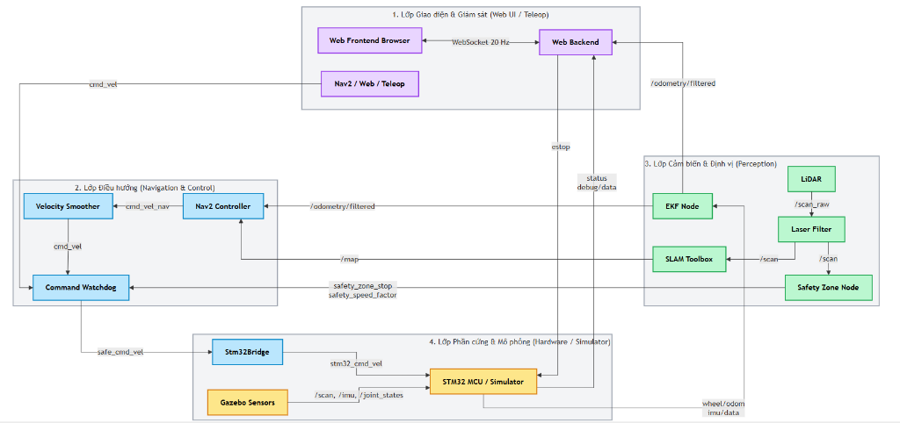
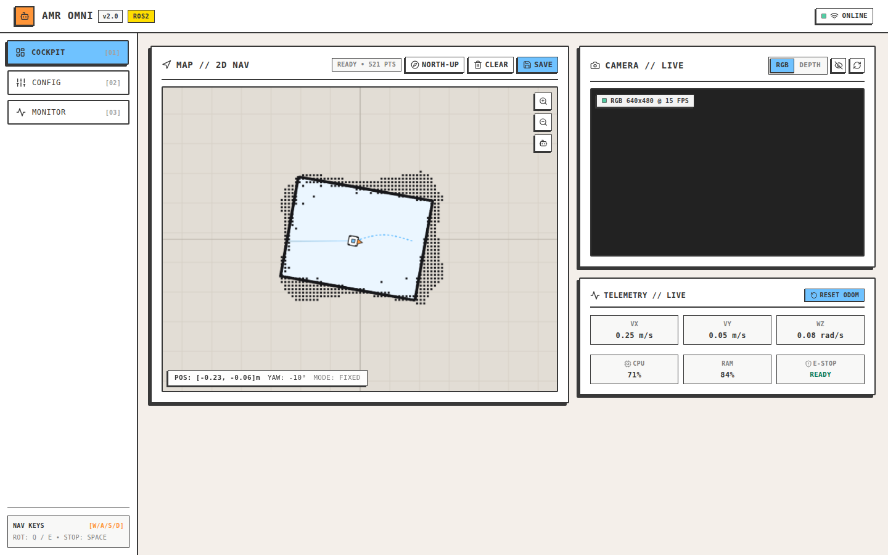
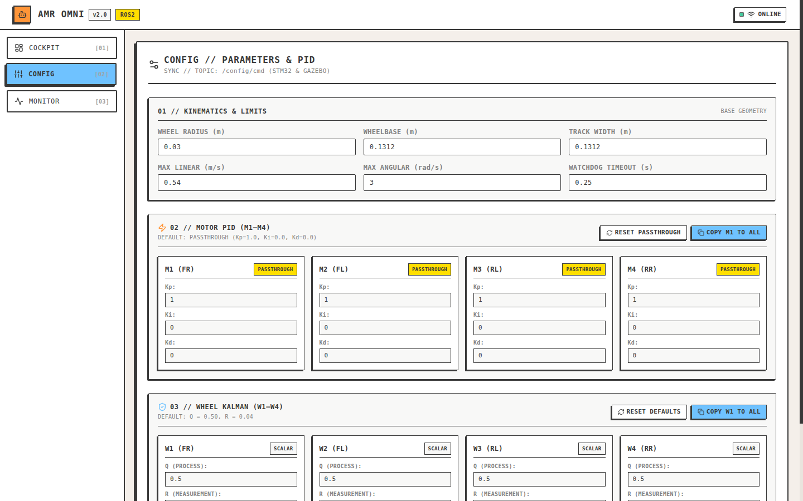
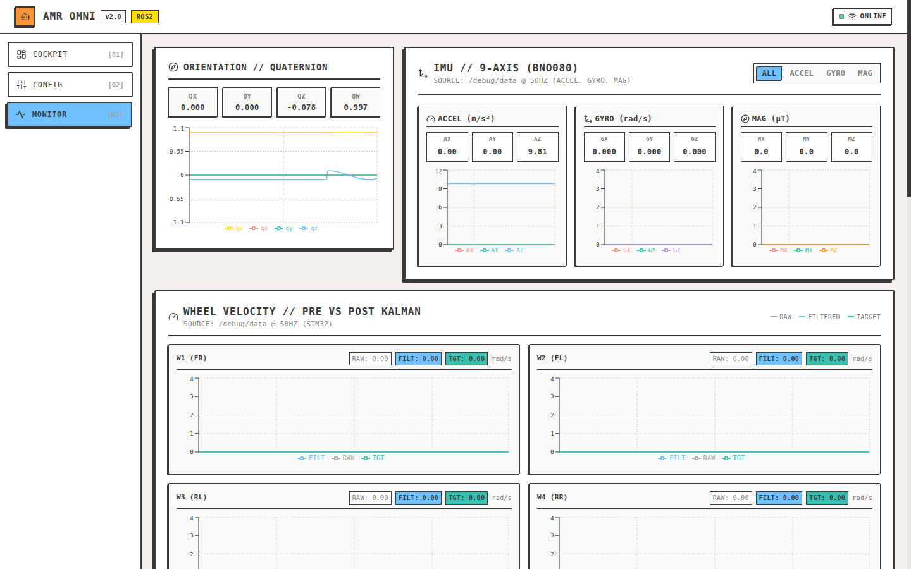
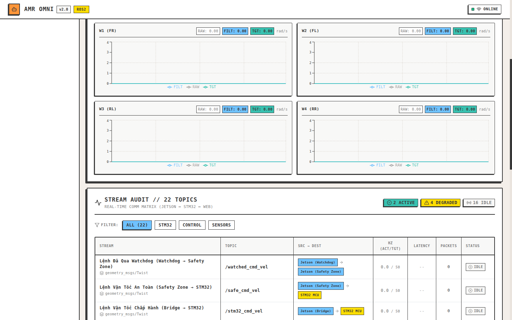

# AMR Omni — Autonomous Mobile Robot Platform

Hệ thống phần mềm toàn diện cho robot tự hành 4 bánh Omni/Mecanum công nghiệp: từ mô phỏng trên ROS 2 Jazzy & Gazebo Harmonic, firmware STM32 (FreeRTOS + micro-ROS), đến giao diện điều khiển và giám sát Web Mission Control hiện đại (FastAPI + Next.js).

---

## 1. Kiến Trúc Luồng Dữ Liệu 4 Lớp (Data Flow Architecture)

Hệ thống được thiết kế theo mô hình phân tầng chặt chẽ, đảm bảo tính mô-đun, an toàn phản xạ và độ trễ thấp giữa các thành phần tính toán cấp cao (Jetson/Host) và bộ điều khiển cấp thấp (STM32 MCU):



### Chi tiết 4 phân tầng kiến trúc:

| Phân tầng | Thành phần chính | Luồng dữ liệu & Vai trò |
|---|---|---|
| **1. Giao diện & Giám sát** *(Web UI / Teleop)* | • Web Frontend (Next.js 14, React)<br>• Web Backend (FastAPI, Uvicorn)<br>• Teleop Controller | • Giao tiếp song công WebSocket 20Hz truyền nhận telemetry và lệnh điều khiển.<br>• Nhận lệnh bàn phím WASD / Space (E-Stop), phát `/cmd_vel` tới bộ điều hướng.<br>• Giám sát thời gian thực `/odometry/filtered`, `/map`, `/scan`, `/debug/data`. |
| **2. Điều hướng & Kiểm soát** *(Navigation & Control)* | • Nav2 Controller<br>• Velocity Smoother<br>• Command Watchdog | • Nav2 tính toán quỹ đạo dựa trên `/map` và `/odometry/filtered`, phát `cmd_vel_nav`.<br>• **Velocity Smoother** lọc gia tốc mượt mà, triệt tiêu giật cục cho cơ cấu omni.<br>• **Command Watchdog** giám sát mất tín hiệu, kết hợp tín hiệu an toàn từ Safety Zone để xuất `safe_cmd_vel`. |
| **3. Cảm biến & Định vị** *(Perception & SLAM)* | • 2D LiDAR & Laser Filter<br>• Safety Zone Node<br>• SLAM Toolbox (Loop Closure)<br>• Robot Localization (EKF) | • LiDAR phát `/scan_raw` qua **Laser Filter** lọc nhiễu trước khi vào các node chức năng.<br>• **Safety Zone Node** tính toán vùng an toàn, phát tín hiệu giảm tốc hoặc dừng khẩn cấp.<br>• **SLAM Toolbox** dựng bản đồ với thuật toán khép vòng (Loop Closure) tối ưu cho không gian lớn.<br>• **EKF Node** hợp nhất quán tính IMU (`/imu/data`) và odometry bánh xe (`/wheel/odom`) xuất `/odometry/filtered`. |
| **4. Phần cứng & Mô phỏng** *(Hardware / Simulator)* | • Stm32Bridge Node<br>• STM32 MCU (FreeRTOS)<br>• Gazebo Harmonic Simulator | • `Stm32Bridge` chuyển đổi `safe_cmd_vel` thành khung truyền UART `stm32_cmd_vel`.<br>• **STM32 MCU** thực thi vòng lặp PID kín 100Hz, bộ lọc Kalman bánh xe và xuất `/debug/data`.<br>• **Gazebo Sensors** mô phỏng chân thực LiDAR, IMU và động học xe trên các bề mặt dốc và gồ ghề. |

---

## 2. Thư Viện Hình Ảnh Minh Họa (Visual Showcase)

Thư mục [`example/`](example/) lưu trữ toàn bộ sơ đồ kiến trúc và ảnh chụp thực tế từng tính năng của hệ thống giao diện Web Mission Control:

### 2.1. Tab [01] — Cockpit & Bản Đồ Điều Hướng 2D
Giao diện buồng lái điều khiển tích hợp bản đồ CAD tối giản, đa giác quét LiDAR trực quan, vệt đường plan nét đứt vi mô, tâm ngắm mục tiêu tinh xảo, luồng camera thời gian thực và thẻ đo xa telemetry.


### 2.2. Tab [02] — Cấu Hình Tham Số & Bộ Điều Khiển PID
Hiệu chỉnh trực tiếp các thông số động học robot (bán kính bánh xe, khoảng cách trục, giới hạn vận tốc), hệ số $K_p, K_i, K_d$ vòng kín của 4 động cơ và ma trận hiệp phương sai bộ lọc Kalman mà không cần nạp lại mã nguồn.


### 2.3. Tab [03] — Giám Sát Cảm Biến & Đồ Thị Đo Xa
Đồ thị thời gian thực theo dõi cảm biến IMU 9 trục BNO080 (Gia tốc, Con quay hồi chuyển, Từ trường), biểu diễn Quaternion hướng không gian 3D, và 4 biểu đồ phân tích vận tốc bánh xe (Raw vs Filtered vs Target).


### 2.4. Kiểm Toán Luồng Truyền Thông (Stream Audit Matrix)
Bảng giám sát chi tiết 22 ROS topics trong hệ thống với tần số thực tế (Hz), độ trễ (Latency), số lượng gói tin và trạng thái kết nối (Active / Degraded / Idle) giữa Jetson, STM32 và Web.


---

## 3. Cấu Trúc Thư Mục Dự Án

```text
amr_omni/
├── example/                          # Sơ đồ luồng dữ liệu và ảnh chụp giao diện hệ thống
│   ├── data_flow_architecture.png   # Sơ đồ kiến trúc luồng dữ liệu 4 lớp
│   ├── 01_tab_cockpit.png           # Giao diện Cockpit & Bản đồ 2D
│   ├── 02_tab_config.png            # Giao diện Cấu hình tham số & PID
│   ├── 03_tab_monitor.png           # Giao diện Giám sát IMU & Vận tốc động cơ
│   └── 04_monitor_stream_matrix.png # Bảng kiểm toán 22 topics thời gian thực
├── firmware/                         # Mã nguồn STM32 PlatformIO (FreeRTOS + micro-ROS)
│   ├── stm32_f407vg_arduino_sim/    # Source hoàn chỉnh cho STM32F407VG Discovery
│   └── stm32_f407vg_stm3cube_sim/   # Scaffold cho STM32CubeIDE
├── scripts/                          # Bộ 5 kịch bản tự động hóa vận hành hệ thống
│   ├── setup.sh                     # Kiểm tra môi trường host, cài đặt công cụ
│   ├── build.sh                     # Biên dịch và chạy test ROS 2, Firmware, Web
│   ├── run.sh                       # Trình chạy hợp nhất: sim, robot, web, bridge
│   ├── flash.sh                     # Nạp firmware an toàn cho STM32
│   └── install.sh                   # Cài đặt Udev rules và Systemd autostart
├── src/                              # Các ROS 2 Packages (Python / C++)
│   ├── omni_bringup/                # Launch files tổng hợp hệ thống (sim & real robot)
│   ├── omni_control/                # Động học Mecanum/Omni 4 bánh & Bộ điều khiển
│   ├── omni_description/            # Mô hình robot Xacro / URDF và Mesh 3D
│   ├── omni_hardware/               # Giao tiếp phần cứng Stm32Bridge, micro-ROS agent
│   ├── omni_localization/           # Cấu hình SLAM Toolbox (Loop Closure) & EKF
│   ├── omni_navigation/             # Cấu hình Nav2 stack, costmaps, planners
│   ├── omni_perception/             # Bộ lọc LaserFilter và Safety Zone
│   ├── omni_safety/                 # Watchdog bảo vệ, E-Stop và giới hạn vận tốc
│   └── omni_simulation/             # Thế giới Gazebo amr_lab.sdf (dốc 5°-14°, gờ giảm tốc)
├── systemd/                          # Dịch vụ tự khởi động hệ thống Linux (systemd)
│   └── amr-bringup.service          # Service tự chạy robot khi boot (micro-ROS, bridge, web)
├── udev/                             # Quy tắc định danh cố định cổng USB (udev rules)
│   ├── 99-amr-stm32.rules           # Symlink cố định /dev/stm32 (STM32 VCP, CH340, CH343)
│   └── 99-amr-lidar.rules           # Symlink cố định /dev/lidar (CP2102, FTDI)
├── web/                              # Giao diện Web Dashboard thời gian thực
│   ├── backend/                     # FastAPI backend, ROS 2 rclpy bridge, WebSocket hub
│   └── frontend/                    # Next.js 14, Tailwind CSS, Recharts, HTML5 Canvas
├── REVIEW.md                         # Khung tiêu chuẩn & tiêu chí thẩm định kỹ thuật toàn diện
├── RULE.md                           # Bộ quy tắc kiến trúc và tiêu chuẩn mã nguồn dự án
└── AGENTS.md                         # Hướng dẫn và quy tắc cho AI Agents & GitNexus
```

---

## 4. Bộ Script Vận Hành (Core Scripts)

Tất cả các script đều hỗ trợ cờ `-h` hoặc `--help` và có thể thực thi từ bất kỳ thư mục con nào:

| Script | Vai trò chính | Lệnh thông dụng |
|---|---|---|
| [`scripts/run.sh`](scripts/run.sh) | **Trình chạy hợp nhất** (`sim`, `robot`, `web`, `bridge`) | `./scripts/run.sh sim` hoặc `./scripts/run.sh robot` |
| [`scripts/flash.sh`](scripts/flash.sh) | Nạp firmware an toàn cho STM32 | `./scripts/flash.sh --mcu stm32f4 --yes` |
| [`scripts/setup.sh`](scripts/setup.sh) | Kiểm tra môi trường host, cài đặt PlatformIO và công cụ nạp | `./scripts/setup.sh --check` |
| [`scripts/build.sh`](scripts/build.sh) | Biên dịch & kiểm thử toàn diện ROS 2, Firmware STM32, Web | `./scripts/build.sh --component all --test` |
| [`scripts/install.sh`](scripts/install.sh) | Cài đặt Udev rules nhận diện cổng USB và Systemd service | `sudo ./scripts/install.sh all` |

### Hướng dẫn sử dụng `scripts/run.sh` theo target:
```bash
./scripts/run.sh --help          # Hiển thị menu hướng dẫn tổng quát
./scripts/run.sh sim --help      # Tùy chọn mô phỏng Gazebo Harmonic & Renode
./scripts/run.sh robot --help    # Tùy chọn hardware bringup (micro-ROS, SLAM, Nav2)
./scripts/run.sh web --help      # Tùy chọn Web Dashboard (FastAPI + Next.js)
./scripts/run.sh bridge --help   # Tùy chọn bridge ROS 1 <-> ROS 2
```

---

## 5. Hướng Dẫn Cài Đặt & Khởi Động Nhanh (Quickstart)

### 5.1. Kiểm tra môi trường
Hệ thống được chuẩn hóa trên môi trường **Ubuntu 24.04 LTS (hoặc WSL2)** với **ROS 2 Jazzy Jalisco**:

```bash
# Kiểm tra sự sẵn sàng của hệ điều hành, ROS 2 và các công cụ
./scripts/setup.sh --check
```

### 5.2. Biên dịch toàn bộ dự án
```bash
# Biên dịch ROS 2 packages, firmware và xuất bản tĩnh Web
./scripts/build.sh --component all --test --skip-empty

# Nạp môi trường ROS 2 sau khi build
source install/ros2_jazzy/local_setup.bash
```

### 5.3. Khởi chạy mô phỏng Gazebo
Môi trường `amr_lab.sdf` tích hợp sẵn 3 loại dốc (5°, 10°, 14°), dải gờ giảm tốc thử thách hệ thống treo/IMU và các vật cản hẹp:

```bash
# Khởi chạy mô phỏng có giao diện 3D (kèm Web Dashboard :8000)
./scripts/run.sh sim

# Hoặc khởi chạy chế độ headless (cho máy chủ / CI không có màn hình)
./scripts/run.sh sim --headless --duration 60
```

### 5.4. Khởi chạy Web Mission Control
Khởi động backend FastAPI và giao diện điều khiển trình duyệt:

```bash
# Chạy Web Dashboard độc lập (cổng 8000)
./scripts/run.sh web

# Hoặc chạy Next.js chế độ hot-reload cho lập trình viên (cổng 3000)
./scripts/run.sh web --dev
```
Truy cập trình duyệt tại địa chỉ: `http://localhost:8000`

### 5.5. Khởi chạy Robot Thực Tế (Hardware Bringup trực tiếp)
Khởi chạy hardware bringup trực tiếp từ terminal (kèm micro-ROS agent kết nối STM32 và Web UI):

```bash
# Khởi chạy bringup cơ bản (cổng mặc định /dev/stm32)
./scripts/run.sh robot

# Khởi chạy kèm SLAM Toolbox và Nav2 stack
./scripts/run.sh robot --slam --nav
```

### 5.6. [Tùy chọn - Robot Thật] Thiết lập Udev Rules & Systemd Daemon
*Lưu ý: Bước này chỉ dùng khi triển khai thực tế trên robot thật / máy tính nhúng (Jetson / x86 SBC / Pi), không cần dùng khi chạy mô phỏng hoặc phát triển trên PC.*

```bash
# 1. Cài đặt udev rules nhận diện cổng USB cố định (/dev/stm32 và /dev/lidar)
sudo ./scripts/install.sh udev

# 2. Cài đặt dịch vụ systemd tự chạy nền khi bật nguồn robot (amr-bringup.service)
sudo ./scripts/install.sh service

# Hoặc cài đặt tất cả và kiểm tra trạng thái
sudo ./scripts/install.sh all
./scripts/install.sh status
```

---

## 6. Tính Năng Kỹ Thuật Nổi Bật

### 6.1. Thuật toán Loop Closure diện rộng (SLAM Toolbox)
File cấu hình [`src/omni_localization/config/slam_params.yaml`](src/omni_localization/config/slam_params.yaml) được tinh chỉnh chuyên sâu cho không gian nhà kho/xưởng lớn:
- Bộ giải tối ưu đồ thị `CeresSolver` với `SPARSE_NORMAL_CHOLESKY` và điều hòa `SCHUR_JACOBI`.
- Hàm mất mát `HuberLoss` chống méo mó khi có nhiễu liên kết.
- Không gian tìm kiếm vòng lặp mở rộng 10.0m với bộ nhớ stack 60MB.

### 6.2. An toàn vận hành đa lớp & Cơ chế E-Stop
- **Command Watchdog:** Tự động phát lệnh vận tốc 0 khi mất kết nối điều khiển quá 500ms.
- **Safety Zone:** Quét chướng ngại vật trong phạm vi nguy hiểm từ LiDAR; tự động kích hoạt phanh dừng an toàn (*fail-safe*) khi phát hiện lỗi đánh giá cảm biến.
- **Phím Space E-Stop:** Nhấn phím Space trên Web Cockpit lập tức hủy toàn bộ mục tiêu tự hành (`active_goal = None`), reset bộ điều khiển và phát chuỗi 5 xung dừng đa kênh tới cả Jetson và STM32.

### 6.3. Firmware STM32 FreeRTOS & micro-ROS
- Vòng lặp điều khiển PID vận tốc 4 bánh xe chu kỳ 10ms (100Hz) chống hiện tượng *derivative kick*.
- Bộ lọc Kalman 1D trên từng kênh encoder bảo vệ chống đột biến vận tốc và giá trị NaN.
- Khóa trường dữ liệu độc lập bảo vệ chống hiện tượng race condition giữa các tác vụ FreeRTOS.
- Tích hợp giao tiếp micro-ROS serial tốc độ cao kết nối liền mạch với ROS 2.

### 6.4. Sẵn sàng Triển Khai Phần Cứng Thật (Production Ready)
- **Định danh cổng USB cố định ([`udev/`](udev/)):** Tự động tạo symlink cố định `/dev/stm32` (hỗ trợ STM32 VCP, chip CH340, CH343) và `/dev/lidar` (hỗ trợ CP2102, FTDI). Không lo nhảy tên cổng tty khi cắm lại hoặc khởi động lại.
- **Dịch vụ hệ thống Linux ([`systemd/`](systemd/)):** File dịch vụ `amr-bringup.service` tự động khởi động sau khi mạng sẵn sàng (`network-online.target`), tự phục hồi khi gặp lỗi (`Restart=on-failure`), đồng bộ nhật ký qua `journald` và nạp sẵn toàn bộ biến môi trường ROS 2 Jazzy.

---

## 7. Khung Tiêu Chuẩn Thẩm Định Kỹ Thuật (`REVIEW.md`)

Dự án áp dụng khung tiêu chuẩn thẩm định chuyên sâu [`REVIEW.md`](REVIEW.md) nhằm phục vụ kiểm toán mã nguồn, kiểm soát chất lượng kỹ thuật tự động hoặc độc lập:

### 5 Nguyên tắc thẩm định cốt lõi:
1. **Safety-First:** Mọi xử lý ngoại lệ bắt buộc phải *fail-safe* (dừng an toàn), nghiêm cấm *fail-open*.
2. **Deterministic & Real-time:** Tuyệt đối không chứa blocking I/O hay tính toán nặng trên luồng chính / callback cảm biến.
3. **Concurrency & Thread-Safety:** Ranh giới luồng rõ ràng, bảo vệ shared states bằng lock/mutex thích hợp.
4. **Physical & Mathematical Fidelity:** Động học, ma trận quán tính (inertia tensor), giới hạn tốc độ và góc quay phải đúng cơ khí thật.
5. **Actionable & Non-Redundant:** Tập trung vào nguyên nhân gốc rễ (root cause) và xuất báo cáo chuẩn tại `RESULT_REVIEW.md`.

### 7 Tiêu chí đánh giá trọng số:
- **Tiêu chí 1 (15%):** Kiến trúc hệ thống, phân tầng logic & cấu hình QoS.
- **Tiêu chí 2 (20%):** Cơ chế an toàn (E-Stop, Watchdog, Safety Zones).
- **Tiêu chí 3 (20%):** Hiệu năng tính toán, ngân sách chu kỳ & độ trễ toàn trình.
- **Tiêu chí 4 (15%):** Quản lý luồng, bất đồng bộ & toàn vẹn dữ liệu.
- **Tiêu chí 5 (10%):** Động học bánh xe Omni/Mecanum & tính toán vật lý.
- **Tiêu chí 6 (10%):** Khả năng sẵn sàng trên phần cứng thật (udev, systemd, reconnect).
- **Tiêu chí 7 (10%):** Chất lượng mã nguồn, tuân thủ DRY, gõ kiểu và kiểm thử tự động.

---

## 8. Kiểm Thử Hệ Thống (QA & Testing)

Dự án duy trì bộ kiểm thử tự động toàn diện bao quát tất cả các tầng:

```bash
# 1. Chạy Unit Test động học và mô phỏng ROS 2
bash -c "source /opt/ros/jazzy/setup.bash && PYTHONPATH=src/omni_bringup:src/omni_hardware:src/omni_safety:src/omni_simulation:src/omni_description:src/omni_navigation:src/omni_localization:src/omni_control:src/omni_perception:\$PYTHONPATH /usr/bin/python3 -m pytest src/omni_bringup/test src/omni_hardware/test src/omni_safety/test src/omni_simulation/test src/omni_description/test src/omni_navigation/test src/omni_localization/test src/omni_perception/test -q"

# 2. Chạy Kiểm thử Web Backend API & Grid Planner
web/backend/.venv/bin/pytest web/backend/tests/test_grid_planner.py web/backend/tests/test_api.py web/backend/tests/test_ros2_bridge_concurrency.py -q
```
*Kết quả xác minh:* **84/84 tests PASS (100%)** *(48 ROS 2 tests + 36 Web backend tests)*.

---

## 9. Quy Tắc Phát Triển & Công Cụ Hỗ Trợ AI Agent

- **Quy chuẩn phát triển:** Bắt buộc tuân thủ tài liệu hướng dẫn [`RULE.md`](RULE.md), [`AGENTS.md`](AGENTS.md) và tiêu chuẩn đánh giá [`REVIEW.md`](REVIEW.md).
- **GitNexus:** Bắt buộc chạy phân tích tác động `node .gitnexus/run.cjs impact` trước khi sửa hàm/class và chạy `node .gitnexus/run.cjs detect-changes --repo amr_omni` trước khi commit mã nguồn.
- **MCP Servers (`.vscode/mcp.json`):** Hệ thống tích hợp sẵn các máy chủ công cụ `chrome-devtools` (kiểm thử giao diện tự động), `next-ai-drawio` (vẽ sơ đồ), `context7` (tra cứu tài liệu), `ruflo` (điều phối đàn agent).