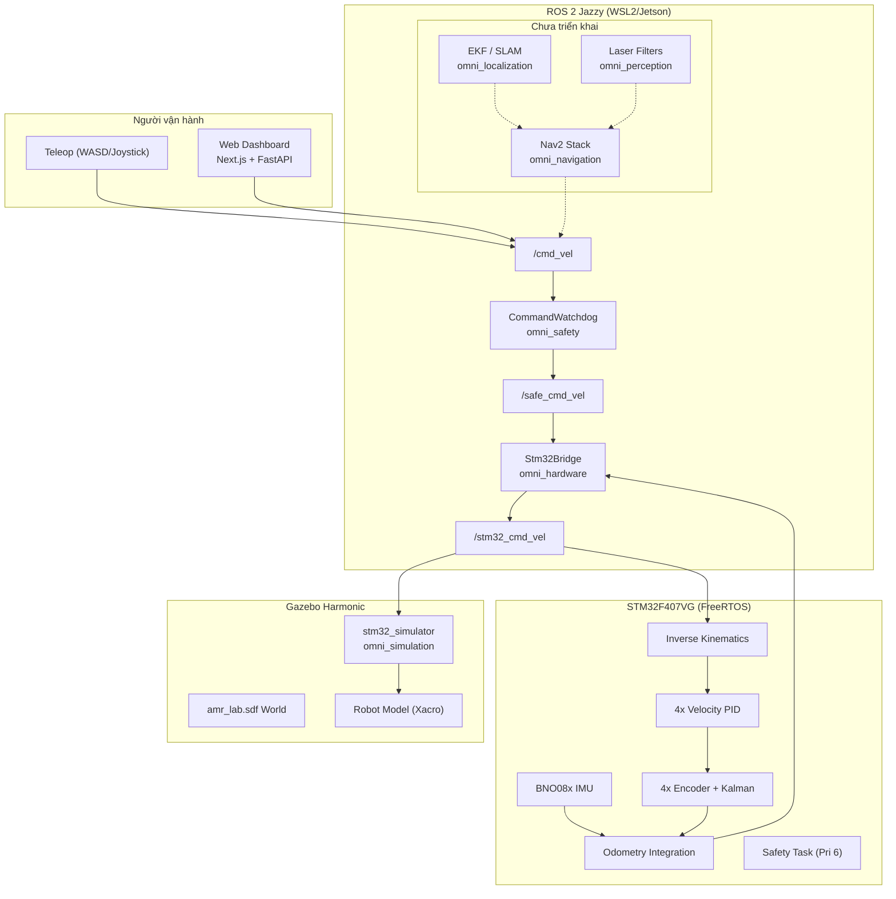
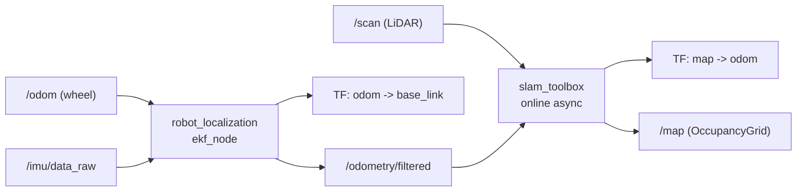

# WORKFLOW — Phân tích toàn diện & Lộ trình hoàn thiện xe tự hành AMR Omni

> **Mục tiêu tài liệu**: Đánh giá toàn bộ codebase hiện tại, đề xuất tối ưu hoá
> (ưu tiên code ngắn gọn, tận dụng thư viện có sẵn), xác định các phần còn thiếu
> và đưa ra lộ trình xây dựng xe tự hành hoàn chỉnh.

> **Lưu ý**: Tài liệu này **chỉ phân tích và đề xuất**, không sửa đổi bất kỳ file
> code nào.

---

## Mục lục

1. [Tổng quan dự án](#1-tổng-quan-dự-án)
2. [Kiến trúc hệ thống](#2-kiến-trúc-hệ-thống)
3. [Thống kê codebase](#3-thống-kê-codebase)
4. [Phân tích chi tiết từng thành phần](#4-phân-tích-chi-tiết-từng-thành-phần)
5. [Đánh giá chất lượng & bug phát hiện](#5-đánh-giá-chất-lượng--bug-phát-hiện)
6. [Đề xuất tối ưu hoá code](#6-đề-xuất-tối-ưu-hoá-code)
7. [Các thành phần còn thiếu cho xe tự hành hoàn chỉnh](#7-các-thành-phần-còn-thiếu-cho-xe-tự-hành-hoàn-chỉnh)
8. [Lộ trình triển khai (Roadmap)](#8-lộ-trình-triển-khai-roadmap)
9. [Ma trận công nghệ & thư viện đề xuất](#9-ma-trận-công-nghệ--thư-viện-đề-xuất)
10. [Checklist hoàn thiện xe tự hành](#10-checklist-hoàn-thiện-xe-tự-hành)

---

## 1. Tổng quan dự án

**AMR Omni** là phần mềm điều khiển xe tự hành 4 bánh omni (Mecanum) với kiến trúc
phân tầng:

- **Mô phỏng**: ROS 2 Jazzy + Gazebo Harmonic trên WSL2 Ubuntu 24.04 (x86_64)
- **Robot thật**: Jetson Nano (aarch64) + ROS 1 Melodic + STM32F407VG (micro-ROS)
- **Firmware MCU**: FreeRTOS + micro-ROS trên STM32F407VG Discovery (PlatformIO)
- **Web Dashboard**: FastAPI (Python) + Next.js 14 (TypeScript) với 3 bridge mode
  (ROS 2 / ROS 1 / Mock Simulator)

### Trạng thái hiện tại

| Thành phần | Trạng thái | Ghi chú |
| :--- | :---: | :--- |
| ROS 2 Packages (6/10 đã implement) | 🟡 | 4 package skeleton trống |
| Firmware STM32 (Arduino) | 🟢 | Build/test pass, 6 FreeRTOS tasks |
| Firmware STM32 (STM32Cube) | 🔴 | Scaffold trống, chưa có source |
| Gazebo Simulation | 🟢 | World + STM32 simulator node |
| Web Dashboard | 🟢 | Full-stack với mock physics |
| Scripts (6 shell scripts) | 🟡 | 1 bug nghiêm trọng, thiếu calibration/diagnostics |
| Navigation (Nav2) | 🔴 | Chưa triển khai |
| Localization (EKF/SLAM) | 🔴 | Chưa triển khai |
| Perception | 🔴 | Chưa triển khai |
| Custom Interfaces | 🔴 | Chưa triển khai |

---

## 2. Kiến trúc hệ thống



### Luồng dữ liệu chính

```text
cmd_vel -> [Watchdog 0.25s] -> safe_cmd_vel -> [STM32 Bridge 50Hz] -> stm32_cmd_vel
    -> [Inverse Kinematics] -> [4x PID 100Hz] -> [PWM Motors]

[4x Encoders 100Hz] -> [Kalman Filter] -> [Forward Kinematics] -> [Odometry]
[BNO08x IMU 50Hz] -> [10x Kalman] -> [Yaw Fusion] -> [Odometry]
    -> /odom + /imu/data_raw + /wheel_state + /encoder_counts + /diagnostics
```

---

## 3. Thống kê codebase

### 3.1. Phân bố dòng code theo thành phần

| Thành phần | Ngôn ngữ | Số dòng (SLOC) | Số file source |
| :--- | :--- | ---: | ---: |
| ROS 2 Packages (`src/`) | Python | ~1,485 | ~25 |
| Firmware (`firmware/`) | C/C++ | ~1,299 | 13 |
| Scripts (`scripts/`) | Bash | ~1,271 | 6 |
| Web Backend (`web/backend/`) | Python | ~1,800 | 14 |
| Web Frontend (`web/frontend/`) | TypeScript/TSX | ~2,100 | 12 |
| **Tổng cộng** | | **~7,955** | **~70** |

### 3.2. Chi tiết file chính theo độ dài

| File | Dòng | Đánh giá |
| :--- | ---: | :--- |
| `firmware/.../main.cpp` | 664 | Monolithic, cần tách module |
| `omni_simulation/stm32_simulator.py` | 429 | Lớn, có dead code (PID unused) |
| `scripts/run_sim.sh` | 432 | Phức tạp, có bug `cleanup_web` |
| `scripts/build.sh` | 354 | Chấp nhận được, nhiều duplicate |
| `web/backend/bridges/mock_bridge.py` | 395 | OK - physics sim + LiDAR ray casting |
| `web/backend/bridges/ros2_bridge.py` | 383 | OK - full ROS 2 integration |
| `omni_hardware/stm32_bridge.py` | 212 | OK |
| `scripts/flash_mcu.sh` | 207 | OK |
| `scripts/run_robot.sh` | 189 | OK |

---

## 4. Phân tích chi tiết từng thành phần

### 4.1. ROS 2 Packages

#### Packages đã triển khai (6/10)

**`omni_control`** — Thư viện toán học thuần (ROS-agnostic)
- `kinematics.py` (64 dòng): Inverse/forward kinematics cho 4-wheel omni 45 degrees
- `pid.py` (91 dòng): `ScalarKalman` + `WheelSpeedPid` với anti-windup
- Test coverage tốt cho kinematics và PID

**`omni_description`** — Mô hình robot URDF/Xacro
- 4 bánh omni với 6 sub-roller mỗi bánh (continuous passive joints)
- Sensor: RGB Camera, Depth Camera, 2D LiDAR (360 mẫu, 5 Hz), IMU (50 Hz)
- Gazebo Harmonic plugins: `joint-state-publisher`, `joint-controller`
- Mesh: DAE/STL cho chassis, camera, omni frame, roller

**`omni_hardware`** — Bridge Jetson <-> STM32
- `stm32_bridge.py` (212 dòng): Relay `safe_cmd_vel` -> `stm32_cmd_vel` @ 50 Hz
- `stm32_contract.py` (27 dòng): Topic names + velocity validation
- Heartbeat watchdog (0.25s timeout), optional telemetry logger (2 Hz)

**`omni_safety`** — Watchdog an toàn
- `command_watchdog.py` (58 dòng): Gate `cmd_vel` -> `safe_cmd_vel` @ 20 Hz
- E-stop software + command timeout -> zero velocity + `safety_stop=True`

**`omni_simulation`** — Gazebo + STM32 emulator
- `stm32_simulator.py` (429 dòng): Emulate firmware logic trong ROS 2
- `amr_lab.sdf`: World với tường, bàn, chướng ngại vật, dock sạc
- `gz_bridge.yaml`: 12 topic bridges (clock, scan, imu, camera, joints, wheels)

**`omni_bringup`** — Entry point
- `simulation_bringup.launch.py` (109 dòng): Orchestrate Gazebo + safety + bridge
- Hỗ trợ web dashboard launch tích hợp

#### Packages skeleton trống (4/10)

| Package | Thư mục có sẵn | Thiếu |
| :--- | :--- | :--- |
| `omni_interfaces` | `action/`, `msg/`, `srv/` | `package.xml`, `CMakeLists.txt`, `.msg/.srv/.action` |
| `omni_localization` | `config/`, `launch/` | `package.xml`, EKF config, SLAM launch |
| `omni_navigation` | `behavior_trees/`, `config/`, `launch/`, `maps/` | `package.xml`, Nav2 params, costmap, BT XML |
| `omni_perception` | `config/`, `launch/`, `nodes/` | `package.xml`, laser filter, depth processing |

---

### 4.2. Firmware STM32

#### Kiến trúc FreeRTOS (6 tasks)

| Task | Priority | Rate | Chức năng |
| :--- | :---: | :---: | :--- |
| `safety_task` | 6 (cao nhất) | 50 Hz | E-stop HW + command timeout -> zero PWM |
| `micro_ros_task` | 5 | 20 Hz pub | RCLC executor + 6 publisher + 2 subscriber |
| `control_task` | 4 | 100 Hz | Inverse kinematics -> 4x PID -> PWM |
| `encoder_task` | 4 | 100 Hz | Tick -> rad/s + Kalman filter |
| `imu_task` | 3 | 50 Hz | BNO08x I2C -> 10x Kalman + quaternion |
| `odometry_task` | 3 | 100 Hz | Forward kinematics + IMU fusion -> pose |

#### Micro-ROS Topics

| Direction | Topic | Type |
| :--- | :--- | :--- |
| Subscribe | `stm32_cmd_vel` | `geometry_msgs/Twist` |
| Subscribe | `estop` | `std_msgs/Bool` |
| Publish | `odom` | `nav_msgs/Odometry` |
| Publish | `imu/data_raw` | `sensor_msgs/Imu` |
| Publish | `wheel_state` | `Float32MultiArray` (12 values) |
| Publish | `encoder_counts` | `Int32MultiArray` (4 values) |
| Publish | `diagnostics` | `DiagnosticArray` |
| Publish | `status` | `String` |

#### Thông số robot

| Tham số | Giá trị |
| :--- | :--- |
| Bán kính bánh | 0.03 m (30 mm) |
| Wheelbase / Track | 0.1312 m |
| Max wheel speed | 18.0 rad/s |
| Max linear speed | 0.54 m/s |
| Max angular speed | 3.0 rad/s |
| Encoder CPR | 2048 |
| Command timeout | 250 ms |
| PID (Kp, Ki, Kd) | 0.08, 0.25, 0.0005 |

---

### 4.3. Web Dashboard

#### Backend (FastAPI)

| Module | Chức năng |
| :--- | :--- |
| `bridges/ros2_bridge.py` | Native `rclpy` với sensor QoS, 13 topics |
| `bridges/ros1_bridge.py` | Rosbridge WebSocket client (port 9090) |
| `bridges/mock_bridge.py` | 50 Hz physics sim + 360 deg LiDAR ray casting |
| `services/telemetry_hub.py` | 20 Hz WebSocket broadcast pool |
| `services/stream_monitor.py` | 10 stream health tracker (60-packet window) |
| `routers/api.py` | REST: status, config, streams, cmd-vel, estop |
| `routers/ws.py` | WebSocket `/ws/telemetry` |

#### Frontend (Next.js 14)

| Component | Chức năng |
| :--- | :--- |
| `TeleopControl.tsx` | 8-way D-pad + 2D joystick + keyboard (WASD) + 12.5 Hz heartbeat |
| `LidarViewer.tsx` | Canvas 2D: 360 deg point cloud, distance rings, local map (3200 pts) |
| `WheelDiagnostics.tsx` | 4 Mecanum wheels: speed, PWM, encoder, error bars |
| `StreamMatrix.tsx` | Jetson <-> STM32 <-> Sensors topology + 10 stream health |
| `SensorCards.tsx` | 6-DOF IMU + Odometry (x, y, theta) |
| `ConfigPanel.tsx` | Geometry, dynamics, PID tuning form |
| `Header.tsx` | Mode badge, connection, watchdog, dark/light, E-STOP |

---

### 4.4. Shell Scripts

| Script | Dòng | Chức năng |
| :--- | ---: | :--- |
| `setup.sh` | 256 | Host audit + cài tool (flash, PlatformIO) |
| `build.sh` | 354 | Build/test ROS 2 + PlatformIO firmware |
| `run_sim.sh` | 432 | Gazebo / Renode / Both + web option |
| `run_robot.sh` | 189 | Jetson Nano ROS 1 bringup |
| `run_web.sh` | 129 | FastAPI + Next.js launcher |
| `flash_mcu.sh` | 207 | Flash STM32 (PIO/OpenOCD/ST-Link/DFU) |
| `calibration/` | — | **Trống** (chỉ `.gitkeep`) |
| `diagnostics/` | — | **Trống** (chỉ `.gitkeep`) |

---

## 5. Đánh giá chất lượng & bug phát hiện

### 5.1. Bug nghiêm trọng (Critical)

**Các bug sau cần sửa ngay trước khi deploy.**

#### BUG-1: `cleanup_web` undefined trong `run_sim.sh`

**File**: `scripts/run_sim.sh:L366-368`

```bash
"${web_command[@]}" &
WEB_PID=$!
trap cleanup_web EXIT INT TERM  # <- cleanup_web KHONG TON TAI
```

**Hậu quả**: Khi chạy `--mode renode --web`, Ctrl-C gây `cleanup_web: command not
found` và process FastAPI bị orphan, không được kill.

**Fix**: Định nghĩa function `cleanup_web` hoặc dùng pattern kill PID đã có.

---

#### BUG-2: Ros1Bridge không gửi command

**File**: `web/backend/app/bridges/ros1_bridge.py:L93-99`

```python
async def send_cmd_vel(self, linear_x, linear_y, angular_z):
    self.stream_monitor.record_event("cmd_vel")  # <- chi record, KHONG publish
```

**Hậu quả**: Web dashboard ở mode ROS 1 không điều khiển được robot. `ws` connection
lưu local variable trong `_connect_loop`, không accessible cho `send_cmd_vel`.

**Fix**: Lưu `self.ws` và gửi `{"op": "publish", "topic": "/cmd_vel", ...}`.

---

#### BUG-3: Double Kalman update trong firmware odometry

**File**: `firmware/.../main.cpp:L592-597`

```cpp
float wz = body_velocity_filters[2].update(wheel_twist.wz_rad_s, delta_sec);
if (!state.imu_fault && isfinite(state.imu.gyro_rad_s[2])) {
    wz = body_velocity_filters[2].update(state.imu.gyro_rad_s[2], delta_sec);
}
```

**Hậu quả**: Khi IMU hoạt động, Kalman filter bị update 2 lần trong cùng timestep,
làm sai lệch covariance và estimate.

**Fix**: Chọn 1 measurement (fused hoặc IMU) rồi update 1 lần.

---

### 5.2. Bug trung bình (Medium)

| ID | File | Mô tả |
| :--- | :--- | :--- |
| BUG-4 | `setup.sh:L107-110` | ROS distro check hardcode `ROS_VERSION != 2`, fail khi chạy trên Jetson với `--ros-distro melodic` |
| BUG-5 | `stm32_simulator.py:L270-276` | 4 PID controllers được allocate nhưng không bao giờ dùng — dead code |
| BUG-6 | `main.cpp:L429+L64` | `Serial.begin(115200)` gọi 2 lần (hardware.cpp + main.cpp) |
| BUG-7 | `main.cpp:L432-436` | micro-ROS agent mất kết nối -> infinite dead loop, không reconnect |
| BUG-8 | `useRobotWs.ts:L36` | "Ping" đo inter-arrival time (~50ms), không phải round-trip latency |
| BUG-9 | `ros2_bridge.py:L226` | CPU/RAM metrics hardcoded (`12.5 + random`), không dùng `psutil` |

### 5.3. Code smell & cải thiện chất lượng

| Vấn đề | Ảnh hưởng | Khuyến nghị |
| :--- | :--- | :--- |
| **`validate_twist` duplicate 3 nơi** | `kinematics.py`, `stm32_contract.py`, `stm32_simulator.py` đều tự implement | Gộp vào `omni_control.kinematics` |
| **Import private API `rclpy.impl`** | `stm32_bridge.py` + `stm32_simulator.py` catch `RCLError` qua private path | Dùng public `rclpy.handle.InvalidHandle` |
| **14+ empty stub directories** | Noise trong codebase | Xoá hoặc thêm `.gitkeep` có mục đích |
| **Hardcode path trong launch** | `simulation_bringup.launch.py` có 30 dòng tìm `../../web/backend` | Dùng `FindPackageShare` hoặc `ament_index` |
| **Test quá yếu** | `test_watchdog_policy.py`: `assertLessEqual(0.25, 0.5)` — mock assertion | Viết test thật với ROS node hoặc mock |
| **`omni_hardware/package.xml`** | Khai báo `nav_msgs` nhưng không import ở đâu | Xoá dependency thừa |

---

## 6. Đề xuất tối ưu hoá code

**Nguyên tắc: Code ngắn nhất có thể, ưu tiên thư viện có sẵn, giữ hoặc tăng
chất lượng.**

### 6.1. ROS 2 Python — Thư viện thay thế để giảm code

| Hiện tại (tự viết) | Thay bằng thư viện | Tiết kiệm | Ghi chú |
| :--- | :--- | ---: | :--- |
| `kinematics.py` (64 dòng): Matrix thủ công | **`numpy`** matrix ops | ~30 dòng | `np.array @ twist` thay vòng lặp |
| `pid.py` ScalarKalman (40 dòng) | **`filterpy.kalman.KalmanFilter`** | ~25 dòng | 1D Kalman chỉ cần 3 dòng setup |
| `pid.py` WheelSpeedPid (50 dòng) | **`simple-pid`** (`pip install simple-pid`) | ~35 dòng | Có sẵn anti-windup, output limits |
| `stm32_simulator.py` TF broadcast (15 dòng) | **`tf2_ros.TransformBroadcaster`** | ~5 dòng | Đã dùng nhưng có thể compact hơn |
| `stm32_simulator.py` quaternion math (8 dòng) | **`transforms3d`** hoặc **`scipy.spatial.transform.Rotation`** | ~5 dòng | `Rotation.from_euler('z', yaw).as_quat()` |
| `mock_bridge.py` LiDAR ray casting (80 dòng) | **`shapely`** geometry intersection | ~30 dòng | `LineString.intersection(Polygon)` |
| `command_watchdog.py` full node (58 dòng) | **`nav2_velocity_smoother`** + config | ~15 dòng | Có sẵn timeout + smoothing trong Nav2 |

#### Ví dụ: Inverse kinematics rút gọn với numpy

```python
# Hien tai: 28 dong vong lap thu cong
# De xuat: 8 dong numpy
import numpy as np

def inverse_kinematics(vx, vy, wz, r, L, W, max_w=18.0):
    d = np.sqrt(0.5)
    R = 0.5 * np.sqrt(L**2 + W**2)
    M = np.array([[ d,  d, R],   # front_left
                  [-d,  d, R],   # front_right
                  [-d, -d, R],   # rear_left
                  [ d, -d, R]])  # rear_right
    wheels = (M @ [vx, vy, wz]) / r
    scale = max(1.0, np.max(np.abs(wheels)) / max_w)
    return (wheels / scale).tolist()
```

### 6.2. Firmware C++ — Tối ưu hoá

| Hiện tại | Đề xuất | Lý do |
| :--- | :--- | :--- |
| `main.cpp` 664 dòng monolithic | Tách thành `ros_comm.cpp`, `tasks.cpp` | Dễ maintain, test riêng |
| Software encoder ISR (~23K int/s) | STM32 Timer Encoder Mode (`TIM_ENCODERMODE_TI12`) | 0% CPU, hardware counting |
| Arduino `analogWrite` (~500 Hz PWM) | HAL Timer PWM 20 kHz | Eliminates motor whine |
| `memcpy` RobotState qua mutex | Lock-free queue hoặc atomic fields | Giảm contention giữa 6 tasks |
| Adafruit BNO08x (blocking I2C) | CEVA SH2 driver + DMA I2C hoặc SPI | Non-blocking, reliable |
| micro-ROS no reconnect | `rmw_uros_ping_agent` + state machine | Auto-recovery |

### 6.3. Scripts Bash — Refactoring chung

Hiện tại 6 scripts có **~200 dòng code duplicate**. Đề xuất extract shared library:

```text
scripts/
+-- lib/
|   +-- common.sh       # die(), info(), warn(), ROOT_DIR, trap management
|   +-- ros_utils.sh    # source_ros(), validate_distro(), fix_log_path()
|   +-- pio_utils.sh    # resolve_firmware(), has_source(), has_tests()
+-- build.sh            # -100 dong sau refactor
+-- run_sim.sh          # -80 dong sau refactor
+-- setup.sh            # -60 dong sau refactor
+-- ...
```

**Code duplicate cụ thể cần gộp:**

| Pattern | Xuất hiện | Dòng tiết kiệm |
| :--- | :--- | ---: |
| `ROOT_DIR="$(git -C ... rev-parse --show-toplevel)"` | 6 scripts | ~12 |
| ROS sourcing (`set +u; source ...; set -u`) | 3 scripts | ~18 |
| PlatformIO project resolution + source check | 2 scripts | ~40 |
| Python venv path lookup | 3 scripts | ~15 |
| `die()` / `info()` / `warn()` / `fail()` functions | 6 scripts | ~60 |
| **Tổng tiết kiệm** | | **~145 dòng** |

### 6.4. Web — Tối ưu hoá

| Hiện tại | Đề xuất | Tiết kiệm |
| :--- | :--- | :--- |
| `TelemetryHub` sequential broadcast | `asyncio.gather(*sends)` | Latency giảm N lần |
| `LidarViewer` array copy `[...buf, ...new].slice(-3200)` | Pre-allocated `Float32Array` ring buffer | GC pressure giảm ~90% |
| Hardcoded port 3000 -> 8000 | `NEXT_PUBLIC_WS_URL` env var | Proxy-compatible |
| CPU/RAM hardcoded | `psutil.cpu_percent()` / `psutil.virtual_memory()` | Real metrics |

---

## 7. Các thành phần còn thiếu cho xe tự hành hoàn chỉnh

### 7.1. Giải pháp điều khiển (Control)

**Hiện tại chỉ có teleop thủ công. Chưa có autonomous control pipeline.**

| Thành phần | Mô tả | Package đích | Thư viện đề xuất |
| :--- | :--- | :--- | :--- |
| **Velocity Smoother** | Giới hạn acceleration/jerk, tránh slip bánh omni | `omni_control` | `nav2_velocity_smoother` (có sẵn) |
| **Trajectory Tracking** | Bám theo path từ planner | `omni_control` | `nav2_regulated_pure_pursuit` hoặc MPPI |
| **Twist Mux** | Priority mux: E-stop > teleop > nav > idle | `omni_control` | `twist_mux` (ROS 2 package có sẵn) |
| **Joystick Driver** | Physical gamepad support | `omni_control` | `joy` + `teleop_twist_joy` (có sẵn) |

### 7.2. Giải pháp tự động (Autonomy)

| Thành phần | Mô tả | Package đích | Thư viện đề xuất |
| :--- | :--- | :--- | :--- |
| **2D SLAM** | Tạo bản đồ từ LiDAR | `omni_localization` | `slam_toolbox` (online async) |
| **Global Localization** | Định vị trên map đã có | `omni_localization` | `nav2_amcl` |
| **Sensor Fusion (EKF)** | Fuse odom + IMU | `omni_localization` | `robot_localization` (`ekf_node`) |
| **Global Planner** | Tìm đường tối ưu | `omni_navigation` | `nav2_navfn_planner` hoặc `smac_planner` |
| **Local Planner** | Tránh vật cản real-time | `omni_navigation` | `nav2_mppi_controller` (holonomic!) |
| **Costmap** | Obstacle layer + inflation | `omni_navigation` | `nav2_costmap_2d` |
| **Behavior Tree** | Recovery + task orchestration | `omni_navigation` | `nav2_bt_navigator` + custom BT XML |
| **Waypoint Navigation** | Multi-point patrol/mission | `omni_navigation` | `nav2_waypoint_follower` |
| **Auto-Docking** | Tự dock sạc pin | `omni_navigation` | `opennav_docking` (Nav2 plugin) |

### 7.3. Giải pháp perception

| Thành phần | Mô tả | Package đích | Thư viện đề xuất |
| :--- | :--- | :--- | :--- |
| **Laser Scan Filter** | Range filter + shadow + footprint mask | `omni_perception` | `laser_filters` (có sẵn) |
| **Depth to LaserScan** | Depth camera -> virtual scan | `omni_perception` | `depthimage_to_laserscan` |
| **Obstacle Detection** | Point cloud clustering | `omni_perception` | `pcl_ros` + `euclidean_cluster` |
| **Visual Fiducials** | AprilTag cho docking | `omni_perception` | `apriltag_ros` |
| **Object Detection** | AI-based obstacle classify | `omni_perception` | `yolov8_ros` hoặc `detectnet` (Jetson) |

### 7.4. Giải pháp an toàn (Safety)

| Thành phần | Mô tả | Trạng thái |
| :--- | :--- | :--- |
| **E-stop vật lý** | Hardware kill switch -> STM32 PD0 | Co (firmware) |
| **Command watchdog** | 0.25s timeout -> zero velocity | Co (omni_safety + firmware) |
| **Software E-stop** | `/estop` topic | Co |
| **Proximity safety zones** | LiDAR slow-down + stop zones | Thieu |
| **Bumper sensors** | Physical contact detection | Thieu (firmware) |
| **Cliff detection** | Optical drop-off sensor | Thieu (firmware) |
| **Motor thermal/overcurrent** | Driver fault pin monitoring | Thieu (firmware) |
| **Battery low-voltage cutoff** | ADC + BMS monitoring | Thieu (firmware) |
| **Independent watchdog (IWDG)** | MCU hardware watchdog | Thieu (firmware) |

### 7.5. Giải pháp tiện ích điều khiển

| Thành phần | Mô tả | Trạng thái |
| :--- | :--- | :--- |
| **Web teleop (WASD/joystick)** | Browser-based control | Co |
| **Web LiDAR viewer** | Real-time 360 deg visualization | Co |
| **Web stream monitor** | 10-stream health matrix | Co |
| **Web config panel** | PID + geometry tuning | Co |
| **Camera video feed** | WebRTC/MJPEG live stream | Thieu |
| **Map management UI** | Save/load/switch maps | Thieu |
| **Nav goal dispatch** | Click-to-navigate on map | Thieu |
| **Path visualization** | Global/local plan overlay | Thieu |
| **Waypoint editor** | Create/save patrol routes | Thieu |
| **Battery dashboard** | SoC, voltage, current, charging | Thieu |
| **Diagnostic tree** | Expandable hardware fault tree | Thieu |
| **Multi-robot fleet** | Namespace switching UI | Thieu |
| **User auth (RBAC)** | Operator roles for safety | Thieu |

### 7.6. Scripts & DevOps còn thiếu

| Script | Chức năng |
| :--- | :--- |
| `calibration/calibrate_odometry.sh` | Square test + rotation test -> wheel radii, chassis dims |
| `calibration/calibrate_imu.sh` | Stationary gyro bias + accelerometer alignment |
| `calibration/calibrate_lidar.sh` | LiDAR -> base_link extrinsic offset |
| `calibration/calibrate_motors.sh` | Encoder CPR + direction + PID tuning |
| `diagnostics/check_hardware.sh` | Serial, LiDAR, IMU, STM32 heartbeat check |
| `diagnostics/check_network.sh` | ROS_MASTER, DDS, WiFi, latency |
| `diagnostics/check_safety.sh` | E-stop state, watchdog, pre-flight check |
| `diagnostics/jetson_health.sh` | nvpmodel, thermal, CPU/GPU throttle, RAM |
| `diagnostics/battery_health.sh` | BMS cell voltages, discharge rate |
| `scripts/install_udev_rules.sh` | Persistent symlinks (`/dev/amr_mcu`, `/dev/amr_lidar`) |
| `scripts/record_bag.sh` | rosbag2 recorder với topic filter |
| `scripts/play_bag.sh` | Replay recorded data |
| `scripts/save_map.sh` | `nav2_map_server` map saver |
| `scripts/install_service.sh` | systemd autostart trên Jetson |
| `scripts/run_bridge.sh` | `ros1_bridge` launcher |

### 7.7. Firmware còn thiếu

| Thành phần | Mô tả |
| :--- | :--- |
| **Hardware timer encoder** | `TIM_ENCODERMODE_TI12` — 0% CPU thay ISR |
| **Battery monitoring** | ADC + INA226 (I2C) -> voltage, current, SoC |
| **Independent watchdog (IWDG)** | Hardware MCU reset khi FreeRTOS deadlock |
| **Motor driver fault pin** | DRV8833/BTS7960 thermal/overcurrent detection |
| **Bumper/cliff sensors** | Digital GPIO input cho contact/drop |
| **NVRAM parameter storage** | Flash emulation cho PID + calibration data |
| **Status LED/buzzer** | WS2812 RGB + buzzer cho trạng thái |
| **20 kHz ultrasonic PWM** | HAL Timer thay Arduino analogWrite |
| **micro-ROS reconnection** | State machine + `rmw_uros_ping_agent` |
| **TF odom to base_link** | Firmware publish TF (hiện chỉ có Odometry msg) |
| **STM32Cube port** | Populate `stm32_f407vg_stm3cube_sim` scaffold |

---

## 8. Lộ trình triển khai (Roadmap)

### Phase 0: Sửa bug & Refactor cơ bản (1-2 tuần)

**Phải hoàn thành trước khi tiến hành các phase sau.**

- [ ] Fix BUG-1: `cleanup_web` undefined trong `run_sim.sh`
- [ ] Fix BUG-2: `Ros1Bridge.send_cmd_vel` không publish
- [ ] Fix BUG-3: Double Kalman update trong firmware odometry
- [ ] Fix BUG-4 to BUG-9: Các bug medium priority
- [ ] Extract `scripts/lib/common.sh` (giảm ~145 dòng duplicate)
- [ ] Gộp `validate_twist` vào 1 nơi duy nhất
- [ ] Xoá dead code (PID unused trong `stm32_simulator.py`)
- [ ] Thêm `.gitkeep` hoặc xoá empty directories

---

### Phase 1: Nền tảng tự hành — Localization (2-3 tuần)



**Triển khai trong `omni_localization`:**

1. **EKF Sensor Fusion** — `robot_localization` package (có sẵn trong ROS 2):
   - Config: `ekf.yaml` fuse `/odom` (x, y, yaw) + `/imu/data_raw` (yaw_vel, accel)
   - Output: `/odometry/filtered` + TF `odom -> base_link`
   - ~30 dòng YAML config + ~20 dòng launch

2. **2D SLAM** — `slam_toolbox` (có sẵn):
   - Config: `slam_params.yaml` cho online async mode
   - Input: `/scan` + `/odometry/filtered`
   - Output: `/map` + TF `map -> odom`
   - ~40 dòng YAML config + ~15 dòng launch

3. **Global Localization** — `nav2_amcl` (có sẵn):
   - Dùng khi map đã có sẵn, không cần SLAM
   - ~25 dòng YAML config

---

### Phase 2: Navigation Stack (3-4 tuần)

**Triển khai trong `omni_navigation`:**

1. **Nav2 Full Stack** — Tất cả là package có sẵn:

```yaml
# nav2_params.yaml (skeleton)
bt_navigator:
  plugin_lib_names: [nav2_compute_path_to_pose_action_bt_node]
  default_bt_xml_filename: navigate_w_replanning_and_recovery.xml

controller_server:
  controller_plugins: [FollowPath]
  FollowPath:
    plugin: nav2_mppi_controller::MPPIController  # holonomic support!
    vx_max: 0.54
    vy_max: 0.54
    wz_max: 3.0

planner_server:
  planner_plugins: [GridBased]
  GridBased:
    plugin: nav2_smac_planner/SmacPlannerLattice  # omni-aware

local_costmap:
  plugins: [static_layer, obstacle_layer, inflation_layer]
  obstacle_layer:
    observation_sources: scan
    scan: {topic: /scan, sensor_model: ray}

global_costmap:
  plugins: [static_layer, obstacle_layer, inflation_layer]
```

2. **Behavior Trees** — XML config cho Nav2:
   - `navigate_w_replanning_and_recovery.xml`
   - Recovery: Spin, Backup, Wait
   - ~60 dòng XML

3. **Waypoint Navigation**:
   - `nav2_waypoint_follower` (có sẵn)
   - Web UI -> POST waypoints -> Action client

---

### Phase 3: Perception & Safety Zones (2-3 tuần)

**Triển khai trong `omni_perception`:**

1. **Laser Filters** — `laser_filters` package (có sẵn):

```yaml
# laser_filter.yaml
scan_filter_chain:
  - name: range_filter
    type: laser_filters/LaserScanRangeFilter
    params: {lower_threshold: 0.08, upper_threshold: 10.0}
  - name: footprint_filter
    type: laser_filters/LaserScanBoxFilter
    params: {box_frame: base_link, min_x: -0.12, max_x: 0.12}
```

2. **Proximity Safety Zones** trong `omni_safety`:
   - Slow-down zone: 0.5m to 1.0m -> giảm speed 50%
   - Safety stop zone: <0.5m -> zero velocity
   - ~80 dòng Python node subscribing `/scan`

3. **Depth Camera Processing**:
   - `depthimage_to_laserscan` (có sẵn) cho negative obstacle detection

---

### Phase 4: Firmware Production (3-4 tuần)

1. **Hardware Timer Encoder** — STM32 TIM Encoder Mode
2. **Battery Monitoring** — ADC + INA226 I2C
3. **Independent Watchdog (IWDG)** — Hardware reset safety
4. **Motor Fault Detection** — Driver fault pin GPIO
5. **20 kHz PWM** — HAL Timer thay Arduino analogWrite
6. **micro-ROS Reconnection** — State machine + `rmw_uros_ping_agent`
7. **NVRAM Parameters** — Flash emulation cho live tuning

---

### Phase 5: Web Dashboard nâng cao (2-3 tuần)

1. **Camera Feed** — WebRTC hoặc MJPEG stream component
2. **Map Management** — Save/load/switch maps UI
3. **Nav Goal Dispatch** — Click-on-map -> `NavigateToPose`
4. **Path Visualization** — Overlay costmap + planned path
5. **Waypoint Editor** — Create/save/execute patrol routes
6. **Battery Dashboard** — SoC gauge, voltage chart, charging status

---

### Phase 6: Jetson Nano Integration (2-3 tuần)

1. **ROS 1 Bringup Package** — `omni_bringup_ros1` cho Melodic
2. **ros1_bridge** — Bridge cmd_vel/odom/scan/diagnostics
3. **systemd Service** — Autostart stack on boot
4. **udev Rules** — Persistent device symlinks
5. **Jetson Health Monitor** — thermal, power mode, GPU utilization

---

## 9. Ma trận công nghệ & thư viện đề xuất

### 9.1. ROS 2 Packages có sẵn (không cần viết lại)

| Chức năng | Package | Install | Code cần viết |
| :--- | :--- | :--- | :--- |
| EKF Sensor Fusion | `robot_localization` | `apt install ros-jazzy-robot-localization` | ~30 dòng YAML |
| 2D SLAM | `slam_toolbox` | `apt install ros-jazzy-slam-toolbox` | ~40 dòng YAML |
| Global Localization | `nav2_amcl` | `apt install ros-jazzy-nav2-amcl` | ~25 dòng YAML |
| Path Planning | `nav2_smac_planner` | `apt install ros-jazzy-nav2-smac-planner` | ~20 dòng YAML |
| Local Control | `nav2_mppi_controller` | `apt install ros-jazzy-nav2-mppi-controller` | ~30 dòng YAML |
| Costmap | `nav2_costmap_2d` | `apt install ros-jazzy-nav2-costmap-2d` | ~40 dòng YAML |
| Behavior Tree | `nav2_bt_navigator` | `apt install ros-jazzy-nav2-bt-navigator` | ~60 dòng XML |
| Velocity Smoother | `nav2_velocity_smoother` | `apt install ros-jazzy-nav2-velocity-smoother` | ~15 dòng YAML |
| Waypoint Follow | `nav2_waypoint_follower` | `apt install ros-jazzy-navigation2` | ~10 dòng launch |
| Auto-Docking | `opennav_docking` | `apt install ros-jazzy-opennav-docking` | ~30 dòng YAML |
| Twist Mux | `twist_mux` | `apt install ros-jazzy-twist-mux` | ~15 dòng YAML |
| Laser Filters | `laser_filters` | `apt install ros-jazzy-laser-filters` | ~20 dòng YAML |
| Depth to Scan | `depthimage_to_laserscan` | `apt install ros-jazzy-depthimage-to-laserscan` | ~10 dòng YAML |
| Joystick | `joy` + `teleop_twist_joy` | `apt install ros-jazzy-teleop-twist-joy` | ~10 dòng YAML |
| AprilTag | `apriltag_ros` | `apt install ros-jazzy-apriltag-ros` | ~15 dòng YAML |
| Map Server | `nav2_map_server` | `apt install ros-jazzy-nav2-map-server` | ~10 dòng YAML |

**Tổng cộng: Chỉ cần ~380 dòng YAML/XML config + ~60 dòng launch Python
để có toàn bộ navigation stack hoàn chỉnh. Không cần viết thuật toán tự hành!**

### 9.2. Python libraries để rút ngắn code

| Library | Dùng cho | pip install |
| :--- | :--- | :--- |
| `numpy` | Matrix kinematics, batch math | `numpy` |
| `simple-pid` | PID controller 1 dòng setup | `simple-pid` |
| `filterpy` | Kalman filter (1D to nD) | `filterpy` |
| `transforms3d` | Euler <-> Quaternion | `transforms3d` |
| `shapely` | 2D geometry (LiDAR ray casting) | `shapely` |
| `psutil` | CPU/RAM/thermal metrics | `psutil` |

### 9.3. Firmware libraries

| Library | Dùng cho | Thay thế |
| :--- | :--- | :--- |
| STM32 HAL Timer | HW encoder + 20kHz PWM | Arduino analogWrite + ISR |
| CEVA SH2 driver | BNO08x non-blocking | Adafruit BNO08x (blocking) |
| Zenoh-Pico | Lightweight pub/sub | micro_ros_platformio |
| CMSIS-RTOS v2 | Standard RTOS API | Manual FreeRTOS extraction |

---

## 10. Checklist hoàn thiện xe tự hành

### 10.1. Phần mềm (Software)

- [x] Kinematics inverse/forward (omni 4 bánh 45 degrees)
- [x] PID velocity controller (4 wheels)
- [x] Kalman filter (1D scalar)
- [x] Command watchdog (0.25s timeout)
- [x] E-stop software
- [x] Gazebo simulation (world + STM32 emulator)
- [x] Web dashboard (teleop + LiDAR + diagnostics)
- [x] Multi-bridge (ROS 2 / ROS 1 / Mock)
- [ ] **EKF sensor fusion** (robot_localization)
- [ ] **2D SLAM** (slam_toolbox)
- [ ] **Global localization** (AMCL)
- [ ] **Navigation stack** (Nav2 — planner + controller + costmap + BT)
- [ ] **Waypoint navigation** (patrol, mission)
- [ ] **Laser scan filters**
- [ ] **Velocity smoother**
- [ ] **Twist mux** (priority control)
- [ ] **Auto-docking** (charging station)
- [ ] **Camera streaming** (WebRTC/MJPEG)
- [ ] **Map management** (save/load/switch)
- [ ] **Nav goal dispatch** (click-to-navigate)

### 10.2. Firmware (MCU)

- [x] FreeRTOS 6-task architecture
- [x] micro-ROS serial transport (Jazzy)
- [x] Inverse/forward kinematics
- [x] 4x PID + anti-windup
- [x] BNO08x IMU integration
- [x] Encoder -> rad/s + Kalman
- [x] Odometry dead-reckoning
- [x] Safety task (priority 6, E-stop + timeout)
- [x] Renode simulation support
- [ ] **Hardware timer encoder** (TIM Encoder Mode)
- [ ] **20 kHz ultrasonic PWM**
- [ ] **Battery monitoring** (ADC + INA226)
- [ ] **Independent watchdog** (IWDG)
- [ ] **Motor fault detection**
- [ ] **micro-ROS reconnection**
- [ ] **NVRAM parameter storage**
- [ ] **TF broadcast** (odom to base_link)
- [ ] **Status LED + buzzer**

### 10.3. Phần cứng (Hardware)

- [ ] Khung xe + 4 motor Mecanum
- [ ] 4x encoder (2048 CPR)
- [ ] STM32F407VG Discovery board
- [ ] BNO08x 9-DOF IMU
- [ ] 2D LiDAR (360 degrees)
- [ ] Depth camera (optional)
- [ ] Jetson Nano + JetPack 4.x
- [ ] E-stop nút nhấn vật lý
- [ ] Pin LiPo + BMS + sạc
- [ ] Motor driver (DRV8833/BTS7960)
- [ ] WiFi antenna
- [ ] Bumper sensor (optional)
- [ ] Cliff sensor (optional)
- [ ] Status LED + buzzer (optional)

### 10.4. DevOps & Vận hành

- [x] Build script (ROS 2 + PlatformIO)
- [x] Simulation launcher (Gazebo + Renode)
- [x] Flash script (PIO/OpenOCD/ST-Link/DFU)
- [x] Web launcher
- [ ] **Calibration scripts** (odometry, IMU, LiDAR, motor)
- [ ] **Diagnostic scripts** (hardware, network, safety, Jetson health)
- [ ] **udev rules** (persistent device symlinks)
- [ ] **rosbag2 recording** (topic-filtered)
- [ ] **Map save/load** automation
- [ ] **systemd service** (Jetson autostart)
- [ ] **ros1_bridge** launcher
- [ ] **CI/CD pipeline** (GitHub Actions)

---

## Kết luận

Dự án AMR Omni đã có nền tảng vững chắc với:
- Kiến trúc phân tầng rõ ràng (shared core -> ROS adapter -> hardware)
- Firmware STM32 chất lượng cao (6 FreeRTOS tasks, safety-first)
- Web dashboard đầy đủ tính năng (teleop, LiDAR, diagnostics)
- Bộ scripts an toàn (validation, dry-run, no sudo)

**Để trở thành xe tự hành hoàn chỉnh**, cần bổ sung:

1. **Ưu tiên cao**: Fix 3 bug critical -> EKF -> SLAM -> Nav2 (~380 dòng config)
2. **Ưu tiên trung bình**: Safety zones -> Firmware production -> Camera feed
3. **Ưu tiên thấp**: Multi-robot fleet -> Auth -> Auto-docking

**Điểm mạnh lớn nhất**: Hầu hết tính năng autonomous đều có sẵn trong hệ sinh
thái Nav2/ROS 2. Chỉ cần **~440 dòng YAML/XML/launch** để có full navigation
stack, thay vì viết hàng nghìn dòng thuật toán từ đầu.

