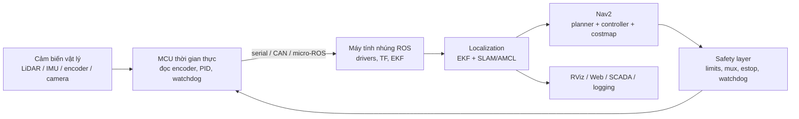
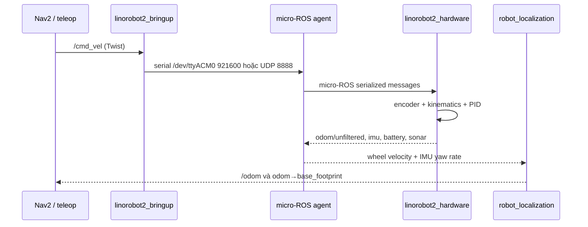
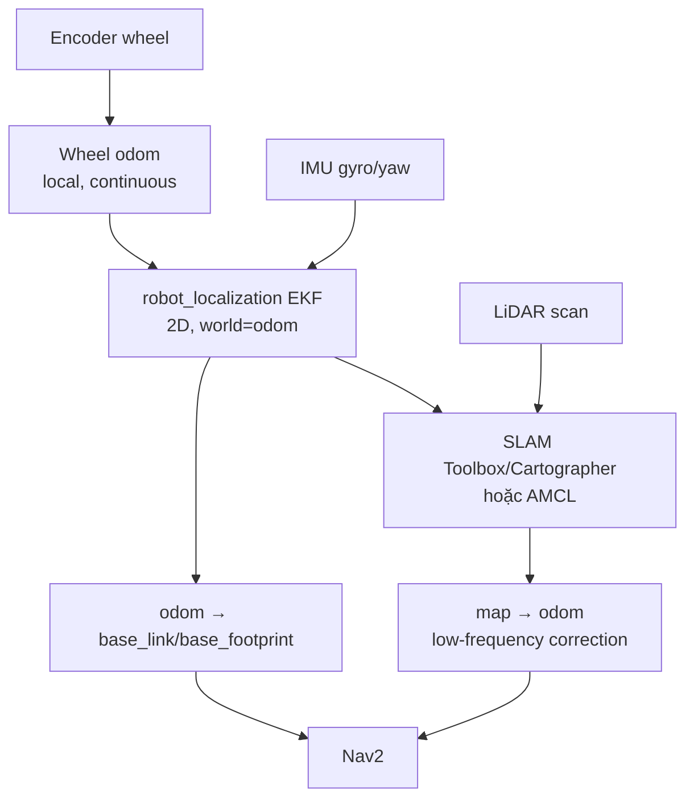

# BÁO CÁO PHÂN TÍCH KIẾN TRÚC ROBOT TỰ HÀNH

## Hướng dẫn trình bày khi chuyển Markdown sang Word

Tài liệu này được viết như một báo cáo kỹ thuật có thể chuyển trực tiếp thành DOCX. Khi chuyển đổi, giữ nguyên các quy tắc sau:

1. `#` là tiêu đề chương, `##` là mục cấp hai, `###` là mục cấp ba. Tạo mục lục tự động từ các heading; không gõ số trang thủ công.
2. Mỗi chương lớn bắt đầu trên trang mới. Dùng font sans-serif dễ đọc cho tiêu đề và font thân bài ổn định; giữ tiếng Việt có dấu.
3. Các bảng dài phải lặp hàng tiêu đề khi sang trang. Không để một hàng bị tách đôi nếu công cụ Word hỗ trợ.
4. Sơ đồ Mermaid được render thành hình ảnh vector hoặc PNG có độ phân giải cao. Chú thích đặt dưới hình theo mẫu `Hình X — ...`.
5. Các đoạn `> [!NOTE]`, `> [!WARNING]`, `> [!TIP]` chuyển thành hộp ghi chú màu nhạt, có nhãn tương ứng.
6. Các kết luận repo-specific phải giữ nguyên path nguồn trong backtick. Đây là “dấu vết kiểm toán” để người đọc mở lại code.
7. Dùng bảng màu tiết chế: xanh đậm cho tiêu đề, xám cho bảng, vàng cho cảnh báo, xanh lá cho khuyến nghị đã xác nhận. Không dùng nền tối cho thân bài.
8. Mỗi chương nên có: **Mục tiêu**, **Bằng chứng nguồn**, **Phân tích**, **Rủi ro**, **Kết luận**. Cuối báo cáo có ma trận so sánh và lộ trình triển khai.
9. Các công thức dùng LaTeX; khi xuất Word phải chuyển thành Equation, không để nguyên chuỗi Markdown nếu trình chuyển đổi hỗ trợ công thức.
10. Không biến các số liệu minh họa thành thông số thiết kế chính thức. Các mục ghi “khuyến nghị” cần được đánh dấu riêng.

> [!WARNING]
> Báo cáo này phân biệt **đã xác nhận từ mã nguồn**, **suy luận kỹ thuật**, và **khuyến nghị thiết kế**. Trước khi chạy robot thật, phải đo lại chiều bánh, encoder, chiều dấu, frame sensor, tần số thực và covariance bằng rosbag/TF inspection.

## MỤC LỤC NỘI DUNG

1. Phạm vi và phương pháp đọc repo  
2. Mô hình chuẩn của một robot tự hành  
3. Phân tích `III-Robot-ROS2`  
4. Phân tích `linorobot2` và `linorobot2_hardware`  
5. Phân tích `ros2_omni_robot_sim`  
6. Phân tích `rosbot_ekf`  
7. Phân tích `wheeltec_ros2`  
8. Đối chiếu với kiến trúc `amr_omni`  
9. EKF, chống trôi và di chuyển chính xác  
10. Kết luận và lộ trình ưu tiên  
11. Phụ lục kiểm thử và từ điển dữ liệu

# 1. PHẠM VI VÀ PHƯƠNG PHÁP ĐỌC REPO

## 1.1. Phạm vi

Đã khảo sát sáu repo trong `/home/sonev/amr_omni/temp`:

| Repo | Vai trò chính | Nền tảng nhìn thấy trong code |
|---|---|---|
| `III-Robot-ROS2` | Mô phỏng Mecanum, Cartographer, Nav2, bridge STM32 thử nghiệm | ROS 2 Humble/Gazebo Classic |
| `linorobot2` | Stack robot thật/mô phỏng, mô tả, EKF, SLAM, Nav2 | ROS 2, nhiều base |
| `linorobot2_hardware` | Firmware micro-ROS, encoder, PID, kinematics | Pico/ESP32/PlatformIO |
| `ros2_omni_robot_sim` | Mô phỏng omni 3–6 bánh | ROS 2 Jazzy/Gazebo Harmonic |
| `rosbot_ekf` | Ví dụ fusion wheel pose + IMU | ROS 1/catkin |
| `wheeltec_ros2` | Hardware Wheeltec, STM32, Nav2, SLAM, SCADA | ROS 2 Humble/custom |

Repo đối chiếu là `/home/sonev/amr_omni`, tập trung ở `src/`, `firmware/`, `scripts/`, `maps/` và `web/`.

## 1.2. Phương pháp và giới hạn

Đã đọc README, manifest, launch, URDF/Xacro, node điều khiển, config EKF/Nav2/SLAM, firmware và các file protocol liên quan; đồng thời lập danh mục source/config để tránh bỏ sót package. Các kết luận bên dưới trích theo path và tên hàm/config. Không coi thư mục `build/`, `install/`, `log/` là source of truth.

> [!NOTE]
> “Đọc toàn bộ repo” trong báo cáo này nghĩa là đã quét cấu trúc và đọc sâu các đường chạy liên quan đến yêu cầu. File sinh tự động, thư viện vendor và log không được diễn giải như thiết kế gốc.

# 2. MÔ HÌNH CHUẨN CỦA MỘT ROBOT TỰ HÀNH

## 2.1. Phân lớp từ cảm biến tới hành động



**Nguyên tắc:** MCU giữ vòng điều khiển động cơ và dừng an toàn; máy tính ROS giữ perception, fusion, map và planning; không để vòng PID phụ thuộc vào mạng hoặc HMI.

## 2.2. Các kiểu dữ liệu chuẩn cần thống nhất

| Dữ liệu | Kiểu ROS 2 khuyến nghị | Đơn vị/quy ước |
|---|---|---|
| Lệnh thân robot | `geometry_msgs/msg/Twist` | `linear.x/y` m/s, `angular.z` rad/s |
| Encoder/joint | `sensor_msgs/msg/JointState` | wheel position rad, velocity rad/s |
| Odometry | `nav_msgs/msg/Odometry` | pose m/quaternion, twist m/s/rad/s, covariance |
| IMU | `sensor_msgs/msg/Imu` | rad/s, m/s², quaternion, covariance |
| LiDAR | `sensor_msgs/msg/LaserScan` | m, rad, frame sensor |
| Transform | TF2 | `map → odom → base_footprint → base_link → sensor` |
| Lệnh wheel dạng controller | `std_msgs/msg/Float64MultiArray` hoặc controller interface | rad/s; chỉ dùng nếu contract rõ |
| Hardware protocol | frame nhị phân cố định | header, sequence, payload signed integer/float, checksum, timeout |

Không truyền `float`/`int16` giữa các thiết bị mà không ghi rõ scale, endian, signedness, checksum và phiên bản frame. Với vận tốc, một protocol dễ kiểm tra có thể dùng signed 16-bit với scale `1000` (m/s hoặc rad/s phải ghi riêng), nhưng phải bão hòa trước khi cast.

# 3. PHÂN TÍCH `III-Robot-ROS2`

## 3.1. Mục tiêu và cấu trúc

Repo mô phỏng robot bốn bánh Mecanum trong Gazebo, tích hợp Cartographer, Nav2, teleop, marker/path và bridge STM32. Các package chính:

| Path | Chức năng |
|---|---|
| `src/bot_description` | URDF/Xacro, mesh, sensor, Gazebo plugin |
| `src/bot_bringup` | launch Gazebo/RViz/state publisher |
| `src/bot_cartographer` | Lua config và launch SLAM |
| `src/bot_navigation2` | Nav2 params/launch |
| `src/bot_programing` | Nav2 action clients |
| `src/bot_teleop` | teleop và test IMU/yaw |
| `src/bot_bag` | path, marker, map |
| `src/bridge` | serial ROS ↔ STM32 |
| `src/bot_interfaces` | message `CtrlMarker` |

Nguồn: `III-Robot-ROS2/README.md`, `src/bot_description/urdf/`, `src/bot_bringup/launch/`.

## 3.2. Kinematics, cảm biến và dữ liệu

`bot_base.urdf.xacro` dùng `wheel_separation_w=0.36`, `wheel_separation_l=0.32`, bán kính bánh `0.0635 m`. Plugin `bot_gazebo_plugin.xacro` nhận `cmd_vel` và điều khiển thứ tự `back_left`, `front_left`, `front_right`, `back_right`.

Các sensor chính:

- LiDAR `/scan`, `sensor_msgs/LaserScan`, frame `lidar`, khoảng 30 Hz, range khoảng `0.12–11 m`.
- Depth camera khoảng `960×540`, khoảng 30 Hz, frame `camera`.
- IMU `imu_n100`, gắn dưới `base_link_2`.
- Joint state từ Gazebo.

Topic cốt lõi gồm `/cmd_vel` (`Twist`), `/odom` (`Odometry`), `/scan`, `joint_states`, `/bot_path` (`Path`) và `/marker_point` (`CtrlMarker`).

## 3.3. MCU/bridge

`src/bridge/bridge/bridge.py` mở serial mặc định `/dev/ttyUSB0`, baud `115200`, timeout `0.2 s`; publish raw `std_msgs/ByteMultiArray` trên `/stm32/recv` và subscribe `/stm32/send`. `protocol.py` có device IDs, `R_RobotVelocity`, handshake và XOR checksum.

Đây là bridge byte-level, chưa phải firmware Mecanum hoàn chỉnh. Packet dài 12 byte và checksum cần được kiểm chứng lại; code còn dấu hiệu xử lý `int.from_bytes()` trên một phần tử integer có thể gây lỗi runtime. Không thấy firmware tương ứng đủ để chứng minh end-to-end.

## 3.4. Localization và rủi ro

Không thấy `robot_localization` EKF. Cartographer (`bot_lds_2d.lua`) dùng odometry và IMU, tracking `base_footprint`, map `map`, published frame `odom`, scan matching và pose graph/loop closure. Gazebo plugin đồng thời có thể publish `odom → base_footprint`.

> [!WARNING]
> Cần bảo đảm chỉ có **một authority** phát `odom → base_footprint`. Nếu Gazebo và Cartographer cùng phát transform, Nav2 sẽ nhận TF không xác định. Repo cũng trộn Humble/Gazebo Classic với workspace chính Jazzy/Harmonic.

## 3.5. Đánh giá

Repo tốt để học mô hình Gazebo + Cartographer + Nav2. Điểm yếu là thiếu EKF chuẩn, bridge thử nghiệm, chưa chứng minh protocol firmware và có nguy cơ duplicate TF. Dùng làm reference simulation, không nên sao chép nguyên trạng sang robot thật.

# 4. PHÂN TÍCH `linorobot2` VÀ `linorobot2_hardware`

## 4.1. Phân lớp của `linorobot2`

`linorobot2` tách khá rõ:

| Package | Vai trò |
|---|---|
| `linorobot2_base` | `robot_localization` EKF |
| `linorobot2_bringup` | micro-ROS agent và sensor bringup |
| `linorobot2_description` | URDF/Xacro, wheel/controller/sensor |
| `linorobot2_gazebo` | mô phỏng |
| `linorobot2_navigation` | SLAM/Nav2/map |
| `docs/` | transforms, controller, installation |
| `docker/` | môi trường phát triển |

Base hỗ trợ `2wd`, `4wd`, `mecanum`; chọn qua `LINOROBOT2_BASE`. Sensor chọn qua `LINOROBOT2_LASER_SENSOR` và `LINOROBOT2_DEPTH_SENSOR`.

## 4.2. Đường dữ liệu phần cứng



`linorobot2_bringup` mặc định dùng serial `/dev/ttyACM0`, baud `921600`, hoặc UDP port `8888`. Cảm biến LiDAR publish `/scan`; depth camera có thể qua `depthimage_to_laserscan_node`.

## 4.3. EKF của `linorobot2`

`linorobot2_base/config/ekf.yaml`:

```yaml
frequency: 50.0
two_d_mode: true
map_frame: map
odom_frame: odom
base_link_frame: base_footprint
world_frame: odom
```

Input `odom/unfiltered` fuse `vx`, `vy`, `vyaw`; input `imu/data` chủ yếu fuse `vyaw`; output `odometry/filtered`, được bringup remap thành `/odom`. Đây là pattern hợp lý: wheel cung cấp vận tốc tịnh tiến, IMU bổ trợ yaw rate, EKF phát TF cục bộ.

Nhưng localization toàn cục vẫn cần SLAM Toolbox hoặc AMCL phát `map → odom`. SLAM config bật scan matching, barycenter và loop closing. Navigation có Rotation Shim + Regulated Pure Pursuit; với Mecanum, cần kiểm tra các tham số lateral và motion model. Một vài config dùng `DifferentialMotionModel` hoặc `base_link` trong khi EKF dùng `base_footprint`, nên phải chuẩn hóa.

## 4.4. `linorobot2_hardware`

Firmware PlatformIO có `encoder/`, `kinematics/`, `odometry/`, `pid/`, `imu/`, `motor/`, `range/`, `battery/`. Target gồm Pico/RP2350, ESP32, ESP32-S2/S3 và general driver board.

Mecanum inverse kinematics trong `firmware/lib/kinematics/kinematics.cpp`:

```text
motor1 = x_rpm - y_rpm - tan_rpm
motor2 = x_rpm + y_rpm + tan_rpm
motor3 = x_rpm + y_rpm - tan_rpm
motor4 = x_rpm - y_rpm + tan_rpm
```

Encoder feedback chạy qua PID từng motor; mặc định trong `lino_base_config.h` là `K_P=0.6`, `K_I=0.8`, `K_D=0.5`. Có đảo chiều encoder/motor, giới hạn RPM và odometry tích phân theo vận tốc thân.

Firmware publish `odom/unfiltered` (`nav_msgs/Odometry`, `odom → base_footprint`), `imu/data` hoặc `imu/data_raw`, `imu/mag`, `battery`, `sonar`; subscribe `/cmd_vel` (`Twist`). Vòng control 50 Hz, command timeout 200 ms; mất micro-ROS agent thì `fullStop()` và destroy entities. Đây là một trong các reference tốt nhất về fail-safe MCU.

## 4.5. Đánh giá

Điểm mạnh là phân lớp phần cứng/ROS rõ, interface hardware và simulation gần giống nhau, có EKF + SLAM + timeout. Điểm cần học có chọn lọc: xác nhận motion model Mecanum trong AMCL/Nav2, chuẩn hóa `base_link`/`base_footprint`, và không dùng config navigation nếu lateral threshold làm mất lệnh `vy` nhỏ.

# 5. PHÂN TÍCH `ros2_omni_robot_sim`

## 5.1. Cấu trúc và đường chạy

Repo là mô phỏng ROS 2 Jazzy + Gazebo Harmonic, hỗ trợ robot omni 3–6 bánh. `launch/gazebo_sim.launch.py` khởi chạy robot state publisher, Gazebo, spawn robot, bridge, controller và node `kinematics`.

`src/kinematics.cpp` nhận `cmd_vel` (`geometry_msgs/msg/Twist`), nhận `joint_states` và `imu`, phát lệnh từng bánh (`std_msgs/msg/Float64MultiArray`) và `odom` (`nav_msgs/msg/Odometry`). URDF tách theo model `3w`, `3w_v2`, `4w`, `5w`, `6w`; controller nằm trong `config/controller_configs/`.

## 5.2. Kinematics và sensor bridge

Ma trận chuyển dùng `wheel radius=0.03 m`, `robot radius=0.088 m`; mỗi bánh có góc riêng. Công thức dạng:

$$
\omega_i = \frac{-\sin(\alpha_i)v_x + \cos(\alpha_i)v_y + R\omega_z}{r}
$$

Gazebo bridge đưa `/imu` (`sensor_msgs/Imu`), `/scan` (`LaserScan`), camera image/info/depth và `/clock` sang ROS. Không có MCU thật; actuator là `gz_ros2_control`.

## 5.3. Vấn đề localization

Node tự tích phân wheel velocity và yaw IMU để phát `odom → base_footprint`. Không có `robot_localization`. Trong code, `vx/vy` của `Odometry.twist` có dấu hiệu không được cập nhật tương ứng dù pose đã tích phân; covariance cũng chưa đủ ý nghĩa. Nav2 dùng `OmniMotionModel` cho AMCL nhưng DWB lại đặt `max_vel_y=0`, `vy_samples=0`, nghĩa là robot omni không thực sự được phép đi ngang.

> [!WARNING]
> Đây là reference tốt để hiểu controller Gazebo, nhưng không dùng trực tiếp làm localization chuẩn. Phải thêm EKF, covariance, timeout, test forward/inverse consistency và bật lateral motion có chủ đích.

# 6. PHÂN TÍCH `rosbot_ekf`

## 6.1. Mục tiêu

Đây là package ROS 1/catkin. `launch/all.launch` ghép rosserial bridge, `msgs_conversion`, `robot_localization/ekf_localization_node` và static TF. Có tùy chọn `rosbot_pro` và `mecanum` nhưng kinematics thực tế nằm trong firmware bên ngoài repo.

## 6.2. Kiểu dữ liệu và EKF

`msgs_conversion.cpp` đổi `geometry_msgs/PoseStamped` thành `nav_msgs/Odometry`, sau đó EKF fuse `odom/wheel` với `imu`. `Configuration.srv` có request `string command`, `string data`; response `string data`, `uint8 result`.

`params/ekf_params.yaml` đặt `frequency=20`, `sensor_timeout=0.2`, `publish_tf=true`, `base_link_frame=base_link`, `world_frame=odom`. Wheel input chủ yếu là pose `x,y,z,yaw`; IMU fuse yaw/yaw rate với differential/relative. `use_control=true` dự đoán từ `vx` và `wz`, timeout `0.2 s`.

Đây là ví dụ dễ hiểu về fusion nhưng có hạn chế: ROS 1, covariance cố định, bật `z` dù robot 2D, không có LiDAR correction, không có wheel kinematics trong repo, và nguồn `PoseStamped` không mang velocity.

# 7. PHÂN TÍCH `wheeltec_ros2`

## 7.1. Cấu trúc hệ thống

Đây là repo giàu chức năng nhất: `turn_on_wheeltec_robot` (driver serial/IMU/odom), `wheeltec_robot_urdf`, `wheeltec_robot_nav2`, `wheeltec_robot_slam`, `wheeltec_robot_rtab`, lidar drivers, `wheeltec_scada_bridge`, auto recharge, waypoint và `stm/` firmware.

Model có `mini_mec`, `mini_omni`, `mini_diff`, `mini_4wd`, `mini_akm`, `mini_tank`. Startup guide mô tả Raspberry Pi chạy ROS/hardware, laptop chạy AI/web.

## 7.2. Serial/CAN contract

Trong `v650_wheeltec_robot.cpp`, `Cmd_Vel_Callback()` đóng gói:

```text
0x7B | reserved | reserved | vx[2] | vy[2] | wz[2] | XOR | 0x7D
```

Vận tốc được scale `1000` thành signed 16-bit. STM32 nhận frame 24 byte; có frame riêng cho ultrasonic và auto-charge. `stm/HARDWARE/can.c` chia buffer thành frame CAN 8 byte với ID `0x101`, `0x102`, `0x103`.

Đây là reference tốt về header/tail/checksum/transport, nhưng phải kiểm tra executable nào thực sự được build vì có cả `wheeltec_robot.cpp` và `v650_wheeltec_robot.cpp`.

## 7.3. Sensor, EKF và SLAM

MPU6050 phát `/imu/data_raw` (`sensor_msgs/Imu`); Madgwick có `use_mag=false`, `publish_tf=false`. Chassis phát `/odom` (`nav_msgs/Odometry`, `odom_combined → base_footprint`). Lidar drivers phát `/scan`; production có thể lọc thành `/scan_filtered`.

`config/ekf.yaml` đặt `frequency=30`, `two_d_mode=true`, `odom_frame=odom_combined`, `base_link_frame=base_footprint`, fuse `vx/vy/vyaw` từ odom và `yaw/vyaw` từ raw IMU, `use_control=false`. Cartographer tracking `base_footprint`, dùng external odom, `use_imu_data=false`, `provide_odom_frame=false`. SLAM Toolbox/RTAB-Map/AMCL cung cấp correction toàn cục tùy mode.

## 7.4. SCADA và rủi ro vận hành

`wheeltec_scada_bridge` dùng ZeroMQ JSON: command 5555, telemetry 5556, camera 5557; có `cmd_vel`, nav goal, patrol, map, log và control SLAM/Nav2. Tuy nhiên code có `shell=True`, bind `0.0.0.0`, hard-code IP/path và production launch có `pkill -9`. Nếu payload từ web đi vào command loop, đây là rủi ro nghiêm trọng; cần allowlist hành động, không nhận shell string tùy ý, bind localhost/VLAN, auth và firewall.

# 8. ĐỐI CHIẾU VỚI KIẾN TRÚC `amr_omni`

## 8.1. Cấu trúc bên ngoài của `amr_omni`

| Path | Chức năng |
|---|---|
| `src/omni_control` | kinematics Python, wheel order, validation |
| `src/omni_hardware` | STM32 bridge và contract topic |
| `src/omni_description` | `chassis.xacro`, `wheels.xacro`, `sensors.xacro` |
| `src/omni_localization` | EKF, AMCL, SLAM params/launch |
| `src/omni_navigation` | Nav2 |
| `src/omni_perception` | depth-to-laser, laser filter |
| `src/omni_safety` | watchdog, estop, safety zone, twist mux config |
| `src/omni_simulation` | simulator STM32 sát firmware |
| `firmware/stm32_f407vg_arduino_sim` | kinematics, PID, scalar Kalman, micro-ROS/RTOS |
| `scripts` | setup, build, run, flash, calibration, bag, map, web |
| `web/backend` | API và test hệ thống |

`amr_omni` nhỏ và tập trung hơn `wheeltec_ros2`, nhưng có boundary tốt hơn giữa control, hardware, localization, perception và safety. So với `linorobot2`, tên topic của bạn rõ hơn ở `wheel/odom`, `imu/data`, `safe_cmd_vel`, `stm32_cmd_vel`.

## 8.2. Ma trận so sánh

| Tiêu chí | `amr_omni` | `III-Robot-ROS2` | `linorobot2` + hardware | `ros2_omni_robot_sim` | `rosbot_ekf` | `wheeltec_ros2` |
|---|---|---|---|---|---|---|
| ROS | ROS 2 Jazzy | ROS 2 Humble | ROS 2 | ROS 2 Jazzy | ROS 1 | ROS 2 Humble |
| Base | 4 omni/Mecanum định hướng riêng | 4 Mecanum | 2wd/4wd/Mecanum | omni 3–6 bánh | ROSbot; kinematics ngoài | nhiều chassis |
| MCU thật | STM32 bridge + simulator | bridge thử nghiệm | micro-ROS firmware | không có | rosserial ngoài repo | STM32 serial/CAN |
| Kinematics | Python + C++ firmware, forward/inverse | Gazebo plugin | firmware rõ | C++ node | không có | chủ yếu MCU |
| EKF | có ROS 2, 50 Hz, 2D | không thấy | có, 50 Hz | không có | có, ROS 1 | có, 30 Hz |
| Safety | watchdog 250 ms, estop, zone | chưa rõ | MCU timeout 200 ms + agent disconnect | thiếu timeout | control timeout | không đồng nhất |
| Global correction | config SLAM/AMCL; lidar odom dự phòng | Cartographer | SLAM Toolbox/AMCL | SLAM/Nav2 nhưng config lateral sai | không có | SLAM/AMCL/RTAB-Map |
| Covariance | EKF + simulator có giá trị | thiếu | firmware có mặc định | thiếu/không chuẩn | cố định | cần kiểm tra |
| Điểm mạnh | boundary, safety, test, firmware tương ứng | simulation phong phú | end-to-end hardware | Gazebo Harmonic | EKF dễ học | chức năng thực địa phong phú |
| Điểm cần sửa | contract/TF/runtime validation | duplicate TF/bridge | frame/motion model | EKF, lateral, odom twist | ROS 1/nguồn ngoài | security/config drift |

## 8.3. Nhận định ngoài nhìn vào

1. `amr_omni` có cấu trúc dễ mở rộng hơn repo mô phỏng đơn lẻ vì đã tách `control`, `hardware`, `localization`, `perception`, `safety`.
2. Bạn đã đi xa hơn `ros2_omni_robot_sim` về safety: `command_watchdog.py` phát zero khi timeout/estop; simulator có command validation, PID, Kalman và covariance.
3. `linorobot2_hardware` vẫn là reference tốt hơn về vòng encoder → PID → odometry trên MCU và micro-ROS disconnect fail-safe.
4. `wheeltec_ros2` mạnh về tích hợp sản phẩm nhưng có technical debt: nhiều biến thể, hard-code và tài liệu/runtime lệch nhau.
5. Khoảng trống lớn nhất của `amr_omni` không phải thêm package, mà là chứng minh calibration, covariance, single TF authority, protocol end-to-end và kiểm thử thực địa.

# 9. EKF, CHỐNG TRÔI VÀ DI CHUYỂN CHÍNH XÁC

## 9.1. EKF không tự “xóa” drift

EKF chỉ ước lượng trạng thái từ mô hình và cảm biến. Nếu chỉ có encoder + IMU, robot vẫn có thể drift vì slip, bias và sai số hình học. Cấu trúc đúng là:



`odom` phải liên tục và mượt cho controller; `map` có thể hiệu chỉnh nhảy nhỏ do scan matching. Không dùng LiDAR SLAM để thay thế vòng encoder/PID.

## 9.2. Cấu hình EKF khuyến nghị cho robot omni 2D

Trong `amr_omni/src/omni_localization/config/ekf.yaml`, hiện tại đã đúng các điểm nền: `frequency=50`, `two_d_mode=true`, `world_frame=odom`, fuse `vx/vy` từ `wheel/odom` và yaw từ `imu/data`, publish TF. Không bật `use_control`, phù hợp khi odometry và IMU đã đủ.

Trước khi chốt, cần kiểm tra:

- `wheel/odom.twist` thực sự chứa `vx`, `vy`, `vyaw` đúng frame body.
- IMU orientation có đúng ENU/ROS convention, dấu yaw đúng và đã bỏ gravity khi dùng acceleration.
- Covariance không đặt quá nhỏ giả tạo. Nếu covariance bằng 0, EKF có thể tin sensor quá mức.
- Chỉ EKF phát `odom → base_link`; hardware/simulator không phát TF nếu EKF đang active.
- `map → odom` chỉ do AMCL/SLAM phát.
- `base_footprint → base_link` là static TF; sensor extrinsics là static TF từ URDF.

## 9.3. Công thức kinematics và các nguồn gây lệch

Với bốn bánh Mecanum, đặt rõ wheel order và dấu trước khi thử nghiệm. Trong `amr_omni/src/omni_control/omni_control/kinematics.py`, ma trận dùng $d=\sqrt{0.5}$ và $R=0.5\sqrt{L^2+W^2}$:

$$
\begin{bmatrix}\omega_1\\\omega_2\\\omega_3\\\omega_4\end{bmatrix}
= \frac{1}{r}
\begin{bmatrix}
d&d&R\\-d&d&R\\-d&-d&R\\d&-d&R
\end{bmatrix}
\begin{bmatrix}v_x\\v_y\\\omega_z\end{bmatrix}
$$

Sai một wheel order, dấu motor, bán kính thực hoặc $L/W$ sẽ tạo ra đường chéo, quay khi đi thẳng hoặc lateral drift. Cần calibration riêng cho từng bánh, không chỉ sửa một hệ số toàn cục.

## 9.4. Quy trình để robot đi thẳng và không trôi

### Bước A — cơ khí và encoder

1. Kiểm tra bánh cùng bán kính tải, roller Mecanum không kẹt, chassis vuông, bánh tiếp đất đều.
2. Đo encoder counts/rev và gear ratio thực; xác nhận chiều dương từng joint.
3. Chạy từng bánh ở tốc độ thấp, so sánh vận tốc đo và setpoint; tune PID từng motor.
4. Dùng `forward_kinematics(inverse_kinematics(twist))` để kiểm tra sai số trước khi chạy Nav2.

### Bước B — calibration chuyển động

Chạy các bài test riêng:

| Test | Lệnh body | Quan sát |
|---|---|---|
| Đi thẳng | $(+v_x,0,0)$ | 4 bánh theo dấu đúng, không quay |
| Lùi | $(-v_x,0,0)$ | không đổi wheel sign bất ngờ |
| Sang phải/trái | $(0,±v_y,0)$ | không có $v_x$ hoặc yaw dư |
| Xoay | $(0,0,±\omega_z)$ | tâm quay không trượt mạnh |
| Hình vuông | 4 cạnh + quay | sai số đóng vòng |
| Chéo | $(v_x,v_y,0)$ | kiểm tra coupling |

Đo pose bằng LiDAR/AprilTag/đường chuẩn, fit scale cho `wheel_radius`, `wheelbase`, `track_width`, và bias riêng trái/phải. Với Mecanum, giảm tốc khi quay đồng thời với lateral để tránh roller slip.

### Bước C — IMU và EKF

1. Giữ robot đứng yên 5–10 phút để đo gyro bias.
2. Kiểm tra quaternion/yaw unwrap và frame `imu_link`.
3. Ước lượng covariance từ rosbag, không lấy số tùy ý.
4. Fuse gyro yaw rate trước; chỉ fuse orientation nếu orientation đã được hiệu chuẩn và frame/world convention đúng.
5. So sánh ba log: wheel odom, IMU, EKF. Nếu EKF dao động, kiểm tra timestamp, covariance và duplicate TF trước khi đổi gain.

### Bước D — LiDAR correction

1. Lọc range lỗi/ngoài vùng; không lọc đến mức mất đặc trưng hình học.
2. Dùng SLAM Toolbox/Cartographer khi lập map; dùng AMCL khi map cố định.
3. Đảm bảo scan timestamp và `laser → base_link` chính xác.
4. Kiểm tra map quality, loop closure và scan matching trong corridor/không gian đối xứng.
5. Không kỳ vọng SLAM sửa được slip tức thời nếu scan ít đặc trưng hoặc tốc độ quá cao.

### Bước E — Nav2 và safety

1. Với omni, bật `vy` có chủ đích trong controller; không để `max_vel_y=0` như `ros2_omni_robot_sim` nếu cần đi ngang.
2. Dùng acceleration/deceleration giới hạn để tránh roller slip.
3. Đặt `cmd_vel` watchdog khoảng 200–300 ms tùy tần số publisher; MCU phải có timeout độc lập.
4. Có `twist_mux`/arbitration với priority rõ: estop > safety > manual > autonomy.
5. Dùng safety zone theo hướng chuyển động; `amr_omni/safety_zone.py` hiện lấy min range toàn vòng, cần mở rộng thành vùng trước/sau/trái/phải nếu muốn tối ưu cho omni.

## 9.5. Chẩn đoán drift theo triệu chứng

| Triệu chứng | Nguyên nhân ưu tiên | Kiểm tra |
|---|---|---|
| Đi thẳng bị cong | wheel scale/dấu, lệch tải, roller | từng wheel velocity, encoder counts |
| Đi ngang có $v_x$ | wheel order hoặc extrinsic | inverse/forward test |
| Đứng yên vẫn quay | gyro bias, duplicate TF | raw IMU, TF publisher list |
| Pose EKF giật | timestamp/covariance/2 authorities | rosbag + `tf2_tools` |
| Map méo khi tăng tốc | slip, scan deskew, tốc độ cao | giảm tốc, xem scan matching |
| Nav2 không đi ngang | controller config | `max_vel_y`, samples, thresholds |
| Robot chạy tiếp khi mất mạng | thiếu watchdog ở MCU | ngắt agent/serial trong test |

# 10. KẾT LUẬN VÀ LỘ TRÌNH ƯU TIÊN

## 10.1. Kết luận

`amr_omni` đang có nền tảng kiến trúc tốt và cân bằng hơn các repo mô phỏng đơn lẻ: có kinematics dùng chung, firmware tương ứng, EKF ROS 2, simulator, safety watchdog và test package. Nên giữ hướng này thay vì hợp nhất nguyên xi một repo khác.

Nên lấy:

- từ `linorobot2_hardware`: micro-ROS lifecycle, encoder/PID/timeout và firmware odometry;
- từ `linorobot2`: phân lớp package, interface simulation/hardware giống nhau và pattern EKF + SLAM;
- từ `wheeltec_ros2`: frame protocol serial/CAN, lidar variants và các bài toán auto-recharge, nhưng không sao chép `shell=True`, hard-code hoặc `pkill -9`;
- từ `III-Robot-ROS2`: Cartographer/marker/path workflow;
- từ `ros2_omni_robot_sim`: Gazebo Harmonic/controller model, sau khi sửa odom và lateral controller;
- từ `rosbot_ekf`: minh họa tối giản về sensor fusion, không dùng ROS 1 code trực tiếp.

## 10.2. Lộ trình đề xuất

| Ưu tiên | Việc | Tiêu chí nghiệm thu |
|---|---|---|
| P0 | Chốt một TF tree và một authority mỗi TF | `map→odom` từ SLAM/AMCL; `odom→base_link` từ EKF; không duplicate |
| P0 | Chốt hardware contract | schema frame, scale, endian, checksum, timeout, version, test vector |
| P0 | Regression kinematics | forward/inverse, wheel order/sign, saturation, NaN/Inf |
| P0 | Test command safety | estop và mất command/agent đều dừng ở ROS và MCU |
| P1 | Calibration encoder/PID | sai số vận tốc từng bánh và đóng vòng trong ngưỡng đặt trước |
| P1 | Đo covariance thực | rosbag đứng yên/chạy thẳng/quay; cập nhật EKF có căn cứ |
| P1 | Lidar/SLAM validation | map không méo ở tốc độ vận hành, loop closure hợp lý |
| P1 | Nav2 omni config | lateral command không bị triệt, controller không tạo slip quá mức |
| P2 | Hardware-in-the-loop | cùng topic contract giữa simulator và STM32 thật |
| P2 | Observability | status, diagnostics, dropped frame, timeout, motor fault, rosbag |
| P2 | Soak test | chạy liên tục, mất mạng, reconnect, battery low, estop/recovery |

# 11. PHỤ LỤC KIỂM THỬ VÀ TỪ ĐIỂN DỮ LIỆU

## 11.1. Checklist trước khi chạy bánh nâng khỏi mặt đất

- [ ] `ros2 topic echo` xác nhận đúng kiểu và tần số `/cmd_vel`, `wheel/odom`, `/imu/data`.
- [ ] `ros2 topic hz` và timestamp không bị đứng hoặc nhảy lùi.
- [ ] `tf2_echo map odom`, `tf2_echo odom base_link`, sensor frames đều tồn tại.
- [ ] Chỉ một node phát `odom → base_link`.
- [ ] Estop xuất hiện ở safety node và MCU.
- [ ] Mất `/cmd_vel` làm `safe_cmd_vel` bằng zero.
- [ ] Mất micro-ROS/serial làm motor output bằng zero.
- [ ] Wheel order trong URDF, Python, simulator và firmware giống nhau.
- [ ] Không có NaN/Inf; mọi message có covariance hợp lệ.
- [ ] Lidar scan frame và extrinsic đã đo.

## 11.2. Traceability source chính

| Chủ đề | Source trong `amr_omni` | Source reference trong `temp` |
|---|---|---|
| Kinematics | `src/omni_control/omni_control/kinematics.py`, `firmware/stm32_f407vg_arduino_sim/src/kinematics.cpp` | `linorobot2_hardware/firmware/lib/kinematics/`, `ros2_omni_robot_sim/src/kinematics.cpp` |
| EKF | `src/omni_localization/config/ekf.yaml` | `linorobot2/linorobot2_base/config/ekf.yaml`, `rosbot_ekf/params/ekf_params.yaml`, `wheeltec_ros2/src/turn_on_wheeltec_robot/config/ekf.yaml` |
| Safety | `src/omni_safety/omni_safety/command_watchdog.py` | `linorobot2_hardware/firmware/src/firmware.ino` timeout/full stop |
| Protocol | `src/omni_hardware/omni_hardware/stm32_contract.py` | `III-Robot-ROS2/src/bridge/bridge/protocol.py`, `wheeltec_ros2/src/turn_on_wheeltec_robot/src/v650_wheeltec_robot.cpp` |
| Simulation | `src/omni_simulation/omni_simulation/stm32_simulator.py` | `ros2_omni_robot_sim/launch/gazebo_sim.launch.py` |
| URDF/TF | `src/omni_description/urdf/` | các thư mục `bot_description`, `linorobot2_description`, `wheeltec_robot_urdf` |

> [!TIP]
> Khi AI khác chuyển file này sang Word, hãy yêu cầu AI giữ nguyên path nguồn, render Mermaid thành hình có caption, tạo TOC tự động, lặp header bảng và biến các hộp `NOTE/WARNING/TIP` thành callout. Không rút gọn phần “Rủi ro” hoặc “Điểm chưa rõ”, vì đó là phần quan trọng nhất để tránh hiểu nhầm rằng robot đã sẵn sàng vận hành.
